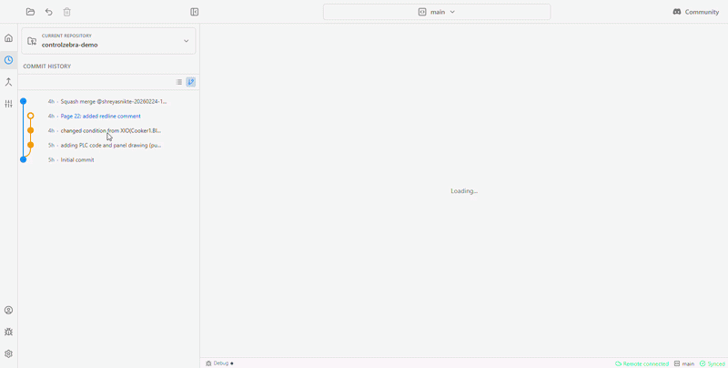

# ControlZebra

ControlZebra is a desktop Git client for industrial automation teams. Track PLC and HMI projects, compare revisions, and share changes without using the command line.

## What you can do

- Save project revisions and browse previous versions.
- Compare ladder logic (`.l5x`), electrical drawing PDFs, images, and text files.
- Review and resolve conflicting changes with a guided workflow.
- Work locally, or connect to GitHub to share and sync with your team.

ControlZebra manages project revisions; keep using your engineering software to edit PLC and HMI projects. Visual comparisons are available for supported file formats, not every project file.

## Download

Get the Windows installer from [ControlZebra releases](https://github.com/ControlZebra/controlzebra-releases/releases).

This repository contains the source code. You do not need to build it to use the desktop app.

## First steps

1. Open your project folder in ControlZebra.
2. Follow the Next Step Advisor to start tracking the project.
3. Make edits in your engineering software, then return to ControlZebra to review and **Save Changes**.
4. Connect to GitHub when you want to share and sync your work.

## Help and feedback

- [Documentation](docs/HOME.md)
- [Report a bug or request a feature](https://github.com/ControlZebra/controlzebra-oss/issues) — include your app version, operating system, and steps to reproduce. Remove confidential project data from screenshots and attachments.
- [Report a security vulnerability privately](SECURITY.md).

## Build and contribute

Read the [contribution guide](CONTRIBUTING.md) for licensing requirements and how to submit changes. Follow the [development setup](docs/onboarding/Development%20Setup.md) for prerequisites and build instructions.

Source builds require the separate `ladder-visualizer` package alongside this repository. It is not bundled here; see the development setup for how to obtain and prepare it before installing dependencies.

## License

The public edition is licensed under the [GNU Affero General Public License v3.0](License.md). For alternative commercial licensing inquiries, contact [support.controlzebra@gmail.com](mailto:support.controlzebra@gmail.com).
