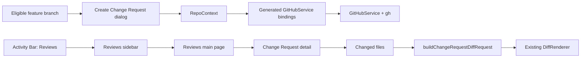

# Change Requests Implementation Plan

## Status

Implementation in progress as of 2026-07-28.

Completed phases:

- Phase 0: Contract and test harness.
- Phase 1: Repository eligibility and list.
- Phase 2: Request detail and industrial summary.
- Phase 3a-1: Snapshot refs.
- Phase 3a-2: Content availability.
- Phase 3b: Read-only Change Request diffs.

Remaining phases:

- Phase 4: Create Change Request.
- Phase 5: Hardening and documentation.

Phase 3a was split after design review. The original single phase combined ref
materialization with content loading, and it specified a base-branch-tip
comparison that would not match GitHub's own file list.

Phase 3b added one backend correction that was not in the original plan:
`resolveBranchRef` now short-circuits fully-qualified `refs/...` names. It
previously tried `origin/refs/controlzebra/...` first and only succeeded through
a fallback, which was fragile for the snapshot refs the viewer depends on.

Phase 3b release gate: text, image, PDF, and L5X must be verified manually
against real requests before shipping. 3D remains best-effort behind the 64 MiB
per-side guardrail.

This document defines the first ControlZebra collaboration workflow for GitHub pull requests. The product calls them **Change Requests** in the normal interface, with GitHub terminology used only where it helps users understand an external GitHub state or link.

## Goal

Let a person working on an industrial project safely submit a branch for review, and let project collaborators inspect team and personal Change Requests through ControlZebra's existing file and visual diff viewers.

The first release must make the normal path obvious:

```text
Create a work branch -> save and push changes -> create Change Request -> inspect changes -> act on GitHub's review outcome
```

The feature should remain understandable for users who do not think in Git terminology while preserving GitHub as the collaboration authority.

## Product Decisions

| Decision | Direction |
| --- | --- |
| Hosting service | GitHub only for the first release. |
| Primary users | Both people submitting changes and people inspecting others' changes. |
| User-facing name | Change Requests. Use "Pull Request" only as contextual GitHub terminology. |
| Navigation | Dedicated `Reviews` activity-bar view, disabled until a Git repository is open. |
| First-release capabilities | Browse open Change Requests, create one, inspect its summary and changed files. |
| Review actions | Read-only in the first release. Formal approve/request-changes actions are a later phase. |
| Merge | Show GitHub merge readiness and blockers only. Do not merge in the app initially. |
| Target branch default | Preselect the repository default branch, normally `main`; allow the user to choose another `origin` branch. |
| Source branch | The currently checked-out local branch. It must be pushed to the GitHub remote before creation. |
| Repository boundary | Create and inspect Change Requests only when the open project is connected directly to its primary GitHub repository. Fork and external-contributor requests are out of scope for the first release. |
| Review metadata | Show reviewers and approval state. |
| Industrial summary | Display a prominent plain-language summary of changed project files before detailed diffs. |
| Visual comparison promise | For non-truncated requests, every supported existing file viewer must compare the exact Change Request base and head snapshots before release. Truncated requests must present an explicit partial-review banner and `Open on GitHub`. |
| Safety authority | GitHub is authoritative for permissions, approvals, and mergeability. ControlZebra adds local safety checks and clear recovery guidance. |

## Scope

### In Scope

- GitHub authentication, repository, and remote eligibility states.
- A `Reviews` view containing open `Team Change Requests` and `Your requests`.
- Create flow for the checked-out, pushed non-default branch.
- Inspection and creation only for requests in the current project's primary GitHub repository.
- Default target branch selection from GitHub repository metadata, with an editable remote-branch selector.
- Request detail: title, description, author, source/target branch, review/approval status, merge readiness, and changed-file list.
- An industrial summary grouped by file category, such as ladder logic, HMI/configuration, drawings/media, and other files.
- Reuse of the existing `DiffRenderer` request contract for text, image, PDF, 3D, and L5X comparison between request base and head refs.
- Refresh on entry, explicit user refresh, repository change, and after creating a request.
- Explicit messages and recovery actions for unavailable GitHub CLI, unauthenticated users, non-GitHub remotes, non-`github.com` hosts, missing or non-primary `origin`, unpushed or diverged branches, permission failures, duplicate requests, snapshot fetch failures, and truncated file lists.

### Out Of Scope

- GitLab, Azure DevOps, Bitbucket, or a provider abstraction.
- Formal approvals, request-changes decisions, general comments, inline comments, labels, assignees, linked issues, checks/CI dashboards, drafts, merge queues, or in-app merge execution.
- Local branch checkout from a Change Request.
- Viewing or creating Change Requests that originate from a fork or other external repository.
- Replacing GitHub's branch-protection model or creating a separate approval system.
- A background notification service. A visible refresh affordance is sufficient for the initial release.

## Existing Architecture To Reuse

| Existing seam | Reuse in Change Requests |
| --- | --- |
| `services/github_service.go` | Own all `gh` command execution and typed GitHub result mapping. It already uses `CommandRunner` and is exposed through Wails. |
| `frontend/bindings/controlzebra/services/githubservice.ts` | Generated bindings for new exported service methods. Regenerate; never edit generated files manually. |
| `frontend/src/domain/repo/context/RepoContext.tsx` and `RepoContext.types.ts` | Own view-ready state, loading/error transitions, and toast behavior for the new workflow. |
| `frontend/src/widgets/layout/ActivityBar.tsx` | Add the repository-gated `Reviews` navigation item. |
| `frontend/src/widgets/layout/Sidebar.tsx` and `view-registry.ts` | Register the sidebar and main-page halves of the dedicated view. |
| `frontend/src/features/explorer/components/ExplorerView.tsx` | Add a contextual action for an eligible pushed feature branch; do not duplicate request creation business logic there. |
| `frontend/src/viewers/registry/diff-request-adapters.ts` | Build comparison sides from the Change Request base and head refs, following existing merge-review behavior. |
| `frontend/src/viewers/components/shared/DiffRenderer.tsx` | Render each selected Change Request file with the existing specialized viewer registry. |

## Solution Design

### Domain Contract

Add transport-oriented Go models in `services/github_service.go`. They should intentionally reflect only data the first-release UI needs.

```go
type GitHubChangeRequest struct {
    Number              int                  `json:"number"`
    Title               string               `json:"title"`
    Body                string               `json:"body,omitempty"`
    URL                 string               `json:"url"`
    State               string               `json:"state"`
    IsDraft             bool                 `json:"isDraft"`
    Author              GitHubChangeAuthor   `json:"author"`
    HeadRefName         string               `json:"headRefName"`
    HeadRefOID          string               `json:"headRefOid"`
    BaseRefName         string               `json:"baseRefName"`
    BaseRefOID          string               `json:"baseRefOid"`
    ReviewDecision      string               `json:"reviewDecision"`
    MergeStateStatus    string               `json:"mergeStateStatus"`
    IsCrossRepository   bool                 `json:"isCrossRepository"`
    CreatedAt           string               `json:"createdAt"`
    UpdatedAt           string               `json:"updatedAt"`
    Reviewers           []GitHubChangeReviewer `json:"reviewers"`
}

type GitHubChangeRequestFile struct {
    Path       string `json:"path"`
    PreviousPath string `json:"previousPath,omitempty"`
    Status     string `json:"status"`
    Additions  int    `json:"additions"`
    Deletions  int    `json:"deletions"`
}
```

Use dedicated result wrappers for every query and mutation. Every result includes:

- `Success` — boolean outcome.
- Typed payload fields — never raw `gh` JSON.
- `Message` — user-neutral success or informational text.
- `Error` — user-safe error text.
- `ErrorCode` — a stable machine-readable code from the enum below. This is required on every result, not optional.

Do not expose raw `gh` JSON to React. Do not switch on CLI error strings in the frontend; switch on `ErrorCode` and render UI text in the view that owns the state.

**Error code enum** (`GitHubChangeRequestErrorCode`):

| Code | Meaning |
| --- | --- |
| `gh_unavailable` | GitHub CLI is not installed or not runnable. |
| `auth_required` | No authenticated GitHub session. |
| `host_unsupported` | The resolved GitHub host is not `github.com`. v1 supports `github.com` only. |
| `origin_missing` | The repository has no `origin` remote. |
| `origin_not_github` | The `origin` remote does not resolve to a GitHub repository. |
| `repository_unresolved` | GitHub CLI could not resolve `origin` to `owner/name`. |
| `permission_denied` | Authenticated user lacks permission for the request. |
| `network_unavailable` | Network or GitHub service unreachable. |
| `rate_limited` | GitHub API rate limit exceeded. |
| `branch_not_synced` | Source branch is not clean, not tracked, or diverged from `origin/<branch>`. |
| `duplicate_request` | An open Change Request already exists for the source branch. |
| `snapshot_unavailable` | The request's base or head could not be fetched from `origin`, or the two share no common history. |
| `snapshot_stale` | The local head snapshot OID no longer matches GitHub's reported `headRefOid`. |
| `snapshot_unsupported` | Cross-repository (fork) requests are out of scope for v1. |
| `content_too_large` | A file side exceeds the in-app comparison size limit. |
| `content_lfs_unavailable` | A file side is an LFS pointer whose object could not be hydrated. |
| `files_truncated` | The returned file list is smaller than GitHub's reported `changedFiles`. |
| `internal_error` | Unhandled failure. Log and surface as generic. |

`snapshot_unsupported` records a **product scope** decision, not a technical
limit. GitHub publishes `refs/pull/<n>/head` in the base repository for fork
requests too, so they are materializable. v1 excludes them because the review
surface, permissions, and creation flow are not designed for external
contributors. Do not re-derive a false technical constraint from this code.

**Host scope.** v1 supports `github.com` only. Repositories that resolve to any other GitHub host must fail eligibility with `host_unsupported`. Enterprise support is deferred; existing authentication is already hardcoded to `github.com`.

The frontend keeps view-model types alongside `RepoContext.types.ts`; it must not reimplement backend parsing rules.

### GitHub CLI Operations

All commands must use `g.runner` and `GhPath()`; no direct `os/exec` calls outside existing special authentication handling.

| Method | Command shape | Purpose |
| --- | --- | --- |
| `GetAuthenticatedUser()` | `gh api --hostname github.com user --jq '{login,id,type,name}'` | Return the authenticated viewer's identity. Frontend grouping and duplicate detection must use `login` from this call. Never parse `gh auth status` output. |
| `GetChangeRequestRepository(repoPath)` | `gh repo view --json nameWithOwner,defaultBranchRef,url,owner` | Verify that `origin` resolves directly to the project's primary `github.com` repository, and obtain the authoritative default branch. |
| `ListChangeRequests(repoPath)` | `gh pr list --repo <owner/name> --state open --limit 100 --json ...` | Load open requests for the resolved repository. Grouping into `Team Change Requests` and `Your requests` uses `login` from `GetAuthenticatedUser`. |
| `FindOpenChangeRequestForBranch(repoPath, sourceBranch)` | `gh pr list --repo <owner/name> --state open --head <owner:branch> --json number,url,headRefName --limit 1` | Deterministic duplicate lookup for a specific source branch. Called at create preflight and again if `gh pr create` reports a duplicate. |
| `GetChangeRequest(repoPath, number)` | `gh pr view <number> --repo <owner/name> --json ...` | Load detail, requested reviewers, latest review decision, base/head refs, and merge status. |
| `ListChangeRequestFiles(repoPath, number)` | `gh api --paginate --slurp repos/{owner}/{repo}/pulls/{number}/files` | Load file metadata as a single JSON array-of-pages. Cross-check flattened length against `pr view.changedFiles`; set `IsTruncated` when smaller. |
| `CreateChangeRequest(repoPath, options)` | `gh pr create --repo <owner/name> --base <base> --head <head> --title <title> --body <body>` | Create a request after every preflight check passes. |

For v1, the project's primary GitHub repository is the repository resolved from the local `origin` remote on host `github.com`. Projects without `origin`, projects whose `origin` cannot be resolved by GitHub CLI, and projects whose GitHub host is not `github.com` are not eligible. `GetChangeRequestRepository` must use the repository path as its command working directory, resolve and retain `nameWithOwner`, and use `--repo owner/name` for every subsequent `gh pr` and `gh api` operation. It must not infer repository ownership from the current account or a string-parsed remote URL.

Use one consistent `--json` field set and decode it into small internal command structs before mapping to exported types. `--slurp` guarantees a single JSON document from paginated `gh api` calls; decode as `[]page` then flatten. Decode REST file results into a separate internal type before mapping `filename`, `previous_filename`, `status`, `additions`, and `deletions` to exported file fields. This isolates GitHub CLI and API field spelling, pagination, and nullability from the Wails contract.

**Origin-exclusive GitService helpers.** Change Requests must not reuse GitService's preferred-remote helpers, which fall back to the first configured remote. Add feature-scoped helpers in `services/git_service.go` and use them exclusively from this feature:

- `OriginRemoteURL(repoPath) (string, error)` — errors when `origin` is missing.
- `OriginRemoteBranches(repoPath) ([]RemoteBranch, error)` — `git ls-remote --heads origin`, excluding symbolic `HEAD`.
- `OriginTrackingUpstream(repoPath, branch) (upstream string, ok bool)` — verifies the local branch tracks `origin/<branch>` specifically.

Existing preferred-remote helpers (`getPreferredRemote`, `GetRemoteURL`) must not
be called from Change Requests **network-mutating or request-scoped** code paths.
See the corrected origin-exclusive scope note in the Diff Design section for why
this rule does not extend to best-effort fallbacks inside the shared viewer read
path.

### Eligibility And Safety

The frontend may offer an entry point only when all conditions are true; the backend must repeat the durable checks needed for command safety.

| Condition | UX behavior |
| --- | --- |
| No open Git repository | Hide request-specific content and disable Reviews navigation. |
| GitHub CLI unavailable | Explain that GitHub tools are required and point to the existing setup flow. |
| Not authenticated | Show the existing device-flow connection action. |
| Current remote is not GitHub | Explain that Change Requests are currently available only for GitHub-connected projects. |
| Resolved GitHub host is not `github.com` | Explain that v1 supports `github.com` only. Return `host_unsupported`. |
| `origin` is missing or is not the project's primary GitHub repository | Explain that Change Requests are available only from the project's primary GitHub connection in this release. |
| Current branch is default branch | Do not offer create; explain that a separate work branch is needed. |
| Sync is incomplete | Do not show the create action. Present `Sync` as the next action; creation must not silently push. |
| Existing open request for source branch | Open that request rather than creating a duplicate. |
| Source equals target | Block creation with a plain-language explanation. |

The create dialog derives its target default from GitHub's `defaultBranchRef.name`, falling back to the existing `MAIN_BRANCHES` list only when that metadata is unavailable. The visible selector remains editable and shows only remote branches that are valid targets.

For Change Request creation, `sync is complete` means all of the following are true: the source is not the default branch, the working tree and index are clean, the branch tracks `origin/<branch>`, and local `HEAD` equals that upstream commit after a refresh. The branch must therefore be neither ahead nor behind. Repeat this verification immediately before `gh pr create`; do not rely on the state that existed when the dialog opened.

The title must be required and trimmed. The description is optional. Do not introduce draft state or reviewer assignment in the first flow.

### Information Architecture

Add `VIEWS.REVIEWS` in `frontend/src/shared/constants/index.ts` and register it throughout the existing layout registry.



The sidebar should prioritize scanning and repeated use:

- `Team Change Requests`: open same-repository requests authored by someone else. Do not show or count requests whose source is a fork or another external repository. When any are omitted, show a neutral note that some external Change Requests are available on GitHub.
- `Your requests`: open requests authored by the authenticated GitHub user.
- A compact count and manual refresh control.
- Select an item to render its detail in the main area.

The main page should not be a generic GitHub clone. It should contain:

1. A compact header with title, request number, author, branch direction, update time, and `Open on GitHub`.
2. A clearly labeled status strip for review decision and GitHub merge readiness. These are informational in v1. Map review information to `approved`, `changes-requested`, `pending`, or `unavailable`; do not collapse an unavailable value into a pending or unapproved result. For `unavailable`, show `Review status not available yet.`
3. The description, when present.
4. An industrial change summary before the file list, for example `2 ladder logic files, 1 HMI configuration, 3 other project files`.
5. A changed-files table that retains GitHub add/delete counts and status.
6. Existing `DiffRenderer` content when a file is selected.

Use the existing shared dialog primitives for creation. Keep the creation dialog focused: source branch (read-only), target branch selector, title, description, and a final `Create Change Request` command.

### Diff Design

Change Requests use immutable local ref names, not raw commit OIDs, so cache keys and specialized viewers behave the same as merge review. OIDs remain the verification contract, but the diff surface consumes ref names.

**The base ref must be the merge base, not the base branch tip.** GitHub's
`/pulls/{n}/files` is a three-dot diff between the merge base and the head. The
renderer this feature reuses, `GitService.DiffMergeReviewFileRaw`, is a two-dot
`old..new` diff. If the base side were the current base-branch tip, every commit
merged into `main` after the branch was cut would render as a *reversal* inside
an unrelated Change Request, and the file list would disagree with the diffs.
Materializing the merge base makes two-dot `base..head` exactly equal to
three-dot merge-base..head, so the existing viewers become correct with no
renderer changes.

**Private ref layout**:

- `refs/controlzebra/change-requests/<n>/head` — mirrors GitHub's `refs/pull/<n>/head`.
- `refs/controlzebra/change-requests/<n>/basetip` — the base branch tip at the moment of fetch. Retained so a later phase can detect that the base branch has moved.
- `refs/controlzebra/change-requests/<n>/base` — the merge base of `head` and `basetip`. **This is the ref every diff compares against.**

**Snapshot lifecycle** — `EnsureChangeRequestSnapshotsLocal(repoPath, number, baseRefName, expectedHeadOID, isCrossRepository) ChangeRequestSnapshotResult`:

1. Preconditions: `origin` is configured; the request is not `IsCrossRepository` (else return `snapshot_unsupported`).
2. Acquire the **backend** per-repository Change Request lock. A frontend lock is insufficient: `RepositorySettingsService` runs auto-fetch, LFS fetch, and maintenance from Go timers that the React layer cannot serialize against.
3. Ensure non-interactive GitHub HTTPS credentials, as the progress-tracked flows already do. Snapshot fetch uses the git transport, so `gh` API auth alone does not authorize a private-repository fetch.
4. One atomic fetch, with a long timeout rather than the 30-second `CommandRunner` default:
   ```
   git -C <repo> fetch --no-tags --atomic origin \
     +refs/pull/<n>/head:refs/controlzebra/change-requests/<n>/head \
     +refs/heads/<baseRefName>:refs/controlzebra/change-requests/<n>/basetip
   ```
   Do not fetch by raw OID. Servers are not required to serve arbitrary object IDs; PR refs and branch refs are. Do not pass `--prune`: with explicit single-destination refspecs it achieves nothing and only adds risk.
5. Resolve `head` with `git rev-parse --verify <ref>^{commit}`. Compare it to `expectedHeadOID`. On mismatch return `snapshot_stale` with the observed OID; the frontend reloads request detail before retrying and must not open a viewer.
6. **Do not verify the base against GitHub's `baseRefOid`.** That value tracks the base branch tip, which moves on every merge into the default branch, so equality checking would report `snapshot_stale` on most opens of an active repository. Instead compute `git merge-base <head> <basetip>` and write it with `git update-ref` to the `base` ref. An empty merge base means the refs share no history; return `snapshot_unavailable`.
7. Return both ref names and the resolved OIDs. Downstream code uses the ref names, never the OIDs, so specialized viewer cache keys stay stable.

**LFS hydration does not belong in this step.** `git lfs fetch origin <ref>`
without `--include` downloads every LFS object in the entire tree at that ref,
twice, to review a two-file request. On the CAD, 3D, and media repositories this
product targets that is a multi-gigabyte blocking download. Hydration is
per-file and lazy — see Phase 3a-2.

**Cleanup**:

- On repository close, repository change, and repository open, delete all `refs/controlzebra/change-requests/*` for that repo. Cleaning on open matters because a crash leaves refs behind that would otherwise anchor objects forever.
- Cleanup runs in Go, not a shell pipeline: `git for-each-ref --format=%(refname)` over the namespace, then a single `git update-ref --stdin` batch of `delete <ref>` lines. `CommandRunner` uses `os/exec` with no shell, so a documented `xargs` pipeline is not executable.
- On explicit refresh of a request, re-run `EnsureChangeRequestSnapshotsLocal`; the `+` refspec force-updates safely.
- When a previously selected request no longer appears in the list (merged or closed upstream), delete that request's refs.

**Content availability** — `EnsureChangeRequestFileContent(repoPath, oldRef, oldPath, newRef, newPath) ChangeRequestFileContentResult`:

Run this before handing a file to a viewer. For each side it resolves the blob,
reports its real size, detects an LFS pointer, and hydrates only that one path.

1. Resolve `<ref>:<path>` with `git rev-parse --verify`. A failure means the side is absent, which is the normal case for additions and deletions and is not an error.
2. Read the blob size with `git cat-file -s`. When the blob is an LFS pointer, take the real size from the pointer's `size` field instead.
3. Reject sides above the comparison size limit with `content_too_large`. Binary sides cross the Wails bridge as base64 inside JSON — roughly 1.33x the file, plus a JavaScript string copy — so a large 3D or media asset will freeze or crash the app rather than render.
4. Hydrate LFS objects for that single path only, scoped to `origin`, with a long timeout: `git lfs fetch --include=<path> origin <ref>`. Report failure as `content_lfs_unavailable` so the viewer shows an explicit per-file warning instead of silently rendering pointer text.
5. Return a `comparable` verdict plus per-side detail. Viewers open only when `comparable` is true.

**Origin-exclusive scope, corrected.** The original rule ("no Change Requests
code path may call `getPreferredRemote`") is not enforceable as written:
`GetFileAtRevisionBase64` and `ReadFileAtRevisionLarge` already reach
`tryFetchLFSForFile`, which uses the preferred remote, and those functions are
the shared read path for every viewer in the app. The rule applies to
**network-mutating and request-scoped** operations — fetch, LFS fetch, push,
branch listing, and create — which must name `origin` explicitly. Best-effort
read-path fallbacks inside shared viewer plumbing are out of its scope, and
forking that plumbing for this feature would be unjustified duplication.

**Diff adapter** — `buildChangeRequestDiffRequest`:

```ts
buildChangeRequestDiffRequest({
  repoPath,
  filePath,
  baseRef: 'refs/controlzebra/change-requests/<n>/base',
  headRef: 'refs/controlzebra/change-requests/<n>/head',
  oldPath,
  fileStatus,
});
```

The adapter preserves the existing added, deleted, renamed, copied, and modified side rules and passes normalized `oldSide` and `newSide` refs to `DiffRenderer`. Never substitute working-tree files for a Change Request diff. Requests marked `snapshot_unsupported`, `snapshot_stale`, or `snapshot_unavailable` must show a clear, non-toast unsupported-state message with `Open on GitHub`.

### State And Refresh Ownership

`RepoContext` remains the only frontend integration facade for this feature. Add state that separates list refresh from selected-detail refresh:

- GitHub repository metadata, viewer `login`, and eligibility.
- Open Change Request list and the omitted-external count.
- Selected request number, detail, files, `TotalFiles`, and `IsTruncated`.
- Active snapshot ref pair for the selected request and its `SnapshotResult`.
- `isLoadingChangeRequests`, `isLoadingChangeRequestDetail`, `isCreatingChangeRequest`, `isPreparingSnapshot`.
- Structured recoverable error per surface, keyed by `ErrorCode`. Do not use toasts as the only representation of a blocking state.
- Actions to load, select, create, clear, and refresh Change Request data.

**Concurrency contract**:

- Change Request creation and snapshot fetch both acquire the existing RepoContext operation lock used by Sync and Push, and the backend per-repository Change Request lock. The frontend lock keeps user-initiated flows ordered; the backend lock is the one that actually guards against `RepositorySettingsService` timers.
- The synced-branch preflight is repeated inside the backend `CreateChangeRequest` immediately before `gh pr create`. If the upstream OID changes between UI preflight and backend re-check, return `branch_not_synced`.
- Duplicate detection runs at two points: `FindOpenChangeRequestForBranch` before `gh pr create`, and again if `gh pr create` returns GitHub's duplicate error. Never silently succeed; never retry create.
- Clear all Change Request state when the repository closes or changes. Reload the list after GitHub authentication changes, a repository remote refresh, explicit user refresh, and successful request creation. Do not add polling in v1.

## Implementation Phases

### Phase 0: Contract And Test Harness - Completed 2026-07-28

Phase 0 lands types and helpers before any UI. No later phase merges until Phase 0 lands first.

1. Confirm the installed `gh` version supports the required `pr` and `api` JSON fields on Windows and macOS, and confirm `gh api --paginate --slurp` returns a single decodable JSON array of pages for the pulls/files endpoint.
2. Add the `GitHubChangeRequestErrorCode` enum in the Go domain contract and stamp it on every new result type. Add the matching TypeScript union in `RepoContext.types.ts`.
3. Add origin-exclusive GitService helpers (`OriginRemoteURL`, `OriginRemoteBranches`, `OriginTrackingUpstream`, `EnsureOriginLFSForRef`) with unit tests. Do not modify existing preferred-remote helpers.
4. Add `GetAuthenticatedUser` in `GitHubService` and wire eligibility to require a non-empty `login`. Retire any Change Requests code path that would parse `gh auth status` output.
5. Gate every Change Requests command on `github.com` host resolution; fail with `host_unsupported` otherwise. Enterprise support is deferred.
6. Add command-result mapping helpers that accept JSON bytes so they can be unit-tested without a live GitHub account. Include fixtures for: successful JSON mapping, missing optional fields, malformed JSON, CLI error strings for auth / permission / network / rate-limit, renamed files, multi-page slurp responses, and the truncation case where `len(files) < changedFiles`.
7. Define Go result models and frontend view types, including stable review states `approved`, `changes-requested`, `pending`, `unavailable`, and the file result's `TotalFiles` and `IsTruncated` fields.
8. Regenerate Wails bindings once the exported types and methods are settled.

Exit criteria: model decoding is deterministic; `ErrorCode` is present on every result; `GetAuthenticatedUser` and origin-exclusive helpers are covered by fixtures; multi-page and truncated file responses decode without loss; bindings expose typed methods and models without manual generated-file edits.

### Phase 1: Repository Eligibility And List - Completed 2026-07-28

1. Add `GetChangeRequestRepository` and `ListChangeRequests` to `GitHubService`, resolving `origin` once (via `OriginRemoteURL` and `GetChangeRequestRepository`) and passing its `owner/name` through every request.
2. Wire `GetAuthenticatedUser` into eligibility and list grouping; group by `login`, not by string-parsed username.
3. Exclude cross-repository requests from the first-release list and expose an omitted-external count for the neutral list note.
4. Validate GitHub CLI, auth, host, and repository eligibility and map each failure to an `ErrorCode` from the enum.
5. Add RepoContext state and actions for repository eligibility and list loading.
6. Add `VIEWS.REVIEWS`, Activity Bar navigation, sidebar registration, main-page registration, and repo-change state cleanup.
7. Implement list empty, loading, unauthenticated, non-GitHub remote, `host_unsupported`, external-request note, and error states.
8. Add focused Go mapper and service tests plus frontend context and view tests.

Exit criteria: an authenticated project connected directly to its primary `github.com` repository shows open `Team Change Requests` and `Your requests`, while every unavailable state explains the next recovery step and every result carries an `ErrorCode`.

### Phase 2: Request Detail And Industrial Summary - Completed 2026-07-28

1. Add `GetChangeRequest` and `ListChangeRequestFiles` backend methods. `ListChangeRequestFiles` uses `gh api --paginate --slurp`, flattens pages, cross-checks against `pr view.changedFiles`, and reports `TotalFiles` and `IsTruncated`.
2. Render selected request metadata, requested reviewers, latest review decision, description, and read-only merge readiness, preserving the `unavailable` review state (null `reviewDecision` never collapses to `pending`).
3. Build a pure file-classification helper using the app's existing viewer and extension knowledge; return category counts and file membership.
4. Render the industrial summary and changed-file table before opening a diff. When `IsTruncated` is true, render an explicit truncation banner with `Open on GitHub` above the file table.
5. Provide `Open on GitHub` using the existing external URL helper.
6. Add tests for reviewer and approval-state display, summary classifications, file status formatting, multi-page slurp decoding, the truncation banner, and selection and loading errors.

Exit criteria: a user can understand what changed before opening a file, then inspect the request without leaving ControlZebra; truncated requests remain honest and actionable rather than silently partial.

### Phase 3a-1: Snapshot Refs

1. Implement `EnsureChangeRequestSnapshotsLocal` per the Diff Design section: atomic fetch of the PR head and base branch tip, strict head-OID verification, local merge-base derivation written to the `base` ref, and structured `snapshot_unavailable` / `snapshot_stale` / `snapshot_unsupported` failures.
2. Add a backend per-repository Change Request lock and make `RepositorySettingsService` background fetch, LFS fetch, and maintenance acquire it, so Go timers cannot race a snapshot fetch.
3. Run the fetch under an explicit long timeout instead of the 30-second `CommandRunner` default, and configure non-interactive GitHub HTTPS credentials first so private-repository fetches do not stall.
4. Implement Go-native cleanup (`for-each-ref` plus a batched `update-ref --stdin`) for the whole namespace and for a single request, and run whole-namespace cleanup on repository open as well as close.
5. Add Go tests for: merge-base selection when the base branch has advanced, head-OID mismatch producing `snapshot_stale`, cross-repository rejection, force-update semantics on refresh, unrelated-history rejection, single-request cleanup, and whole-namespace cleanup.

Exit criteria: for any eligible request, `head` resolves to the OID GitHub reported and `base` resolves to the merge base, so a two-dot `base..head` diff matches GitHub's own file list; leftover refs are deleted deterministically; no code path fetches from a non-origin remote.

### Phase 3a-2: Content Availability

1. Implement `EnsureChangeRequestFileContent`: per-side blob resolution, real size reporting through the LFS pointer when present, and a `comparable` verdict.
2. Enforce the comparison size limit and return `content_too_large` rather than letting a large binary cross the Wails bridge as base64.
3. Hydrate LFS per file and per side with `--include=<path>` against `origin` under a long timeout, returning `content_lfs_unavailable` on failure.
4. Add Go tests for: absent sides on additions and deletions, plain blob sizing, LFS pointer size extraction, the size limit boundary, and the `comparable` verdict across the added, deleted, and modified cases.

Exit criteria: opening any Change Request file reports an honest availability verdict before content is materialized; oversized files and unhydratable LFS objects produce explicit states instead of a frozen window or pointer text.

### Phase 3b: Read-Only Change Request Diffs

1. Add `buildChangeRequestDiffRequest` to the existing diff adapter module. The adapter consumes the private ref names returned by Phase 3a-1, not raw OIDs.
2. Gate viewer mount on the Phase 3a-2 `comparable` verdict, rendering the `content_too_large` and `content_lfs_unavailable` states inline with `Open on GitHub`.
3. Route the selected changed file through the shared `DiffRenderer`. Add a test that `DiffMergeReviewFileRaw` accepts fully-qualified `refs/...` names, since `resolveBranchRef` is branch-name-oriented and currently succeeds on them only by fallback.
4. Verify text, image, PDF, and L5X against existing viewer fixtures for requests whose file list is not truncated. This is the release gate. 3D is best-effort behind the size guardrail, because `online-3d-viewer` memory behavior on large assemblies should not block the feature.
5. When `IsTruncated` is true, render an explicit truncation banner and `Open on GitHub` above the file table; visible files still open through the shared viewer path.
6. Preserve loading and error states for missing or fetch-unavailable refs; never fall back to working-tree comparison.

Exit criteria: every gated diff viewer receives private-ref sides for non-truncated requests, and truncated requests display a clear, honest partial-review state that directs the user to GitHub for the remainder.

### Phase 4: Create Change Request

1. Add `OriginRemoteBranches`-backed target selection and `CreateChangeRequest` to `GitHubService`. Filter out symbolic `origin/HEAD` and re-fetch on dialog open so stale local remote-tracking refs cannot appear.
2. Add `FindOpenChangeRequestForBranch` and call it before opening the create dialog; a match routes the user to the existing request detail rather than the create form.
3. Add a reusable create dialog launched from the Reviews page and the eligible feature-branch Explorer state.
4. Preselect GitHub's default branch as the target and allow a valid `origin` branch change.
5. Show the create action only after the checked-out non-default source branch satisfies the defined synced-branch rule. Recheck that rule inside the backend `CreateChangeRequest` immediately before `gh pr create`. Use existing Sync and Push flows as recovery, not implicit side effects.
6. If `gh pr create` reports a duplicate (HTTP 422 or GitHub's duplicate message), re-run `FindOpenChangeRequestForBranch`, return `duplicate_request` with the discovered request, and route to detail. Never retry create.
7. On success, show a concise confirmation, refresh the list, select the new request, kick off snapshot fetch, and surface its GitHub URL.
8. Add tests for target defaulting, source and target validation, unpushed and behind branches, uncommitted work, duplicate detection at preflight, duplicate detection at create-time race, upstream OID change between preflight and create (`branch_not_synced`), successful creation, and service failures mapped by `ErrorCode`.

Exit criteria: a user can create exactly one well-formed request from their current pushed branch and immediately inspect it, and no code path can silently succeed on a duplicate or stale-branch create.

### Phase 5: Hardening And Documentation

1. Run cross-platform manual checks with directly connected GitHub user and organization repositories, private repositories, protected default branches, and branch names containing `/`.
2. Confirm local safety messages do not claim to override GitHub permission or protection decisions.
3. Add user documentation using Change Requests terminology and a brief explanation of the GitHub connection requirement.
4. Add developer documentation for the GitHub CLI field contract, generated-binding step, and diff-ref fetch assumptions.
5. Add the plan's implemented status and final scope to `docs/plans/summary/PLANS_SUMMARY.md` when the feature ships.

## File Checklist

### Backend

- `services/github_service.go` — add `GetAuthenticatedUser`, `GetChangeRequestRepository`, `ListChangeRequests`, `FindOpenChangeRequestForBranch`, `GetChangeRequest`, `ListChangeRequestFiles`, `CreateChangeRequest`, result models, and the `GitHubChangeRequestErrorCode` enum.
- `services/change_request_snapshot.go` — snapshot ref lifecycle, per-repository lock, cleanup, and per-file content availability.
- `services/change_request_snapshot_test.go` — snapshot and content-availability tests against real temporary repositories.
- `services/github_service_test.go` — fixture-driven tests covering every result and error code.
- `services/git_service.go` — add origin-exclusive helpers (`OriginRemoteURL`, `OriginRemoteBranches`, `OriginTrackingUpstream`) plus tests. Do not modify existing preferred-remote helpers.

### Generated Bindings

- `frontend/bindings/controlzebra/services/githubservice.ts` (generated)
- `frontend/bindings/controlzebra/services/models.ts` (generated)

### Frontend State And Layout

- `frontend/src/domain/repo/context/RepoContext.tsx`
- `frontend/src/domain/repo/context/RepoContext.types.ts`
- `frontend/src/shared/constants/index.ts`
- `frontend/src/widgets/layout/ActivityBar.tsx`
- `frontend/src/widgets/layout/Sidebar.tsx`
- `frontend/src/widgets/layout/view-registry.ts`

### Frontend Feature Surface

- Add `frontend/src/features/reviews/` for the dedicated view, page, request list, detail, summary, file table, and create dialog.
- `frontend/src/features/explorer/components/ExplorerView.tsx`
- `frontend/src/viewers/registry/diff-request-adapters.ts`
- Reuse `frontend/src/viewers/components/shared/DiffRenderer.tsx`; avoid creating parallel specialized-diff components.

### Documentation

- Add a user-facing Change Requests guide under `docs/` when the feature is implemented.
- Add GitHub CLI and diff-contract notes to the applicable technical documentation.
- `docs/plans/summary/PLANS_SUMMARY.md` after implementation status changes.

## Validation

Run focused checks as each phase lands:

```bash
go test ./services/... -run 'TestGitHubService|Test.*ChangeRequest' -v
task common:generate:bindings
cd frontend && npm run typecheck
cd frontend && npm test -- --run src/features/reviews
```

Before merging the completed feature:

```bash
go test ./services/... -v
cd frontend && npm test
cd frontend && npm run ci:guards
```

Manual acceptance checks:

1. Reviews is unavailable without an open Git repository and explains missing GitHub prerequisites in-repo. Non-`github.com` hosts show `host_unsupported`.
2. An authenticated project connected directly to its `origin` `github.com` repository displays eligible open requests separated into `Team Change Requests` and `Your requests` groups using `login` from `GetAuthenticatedUser`. Fork and external requests are excluded and reported as an omitted-external count.
3. A selected request clearly shows its source and target branches, reviewers, review decision, merge readiness, and an industrial file summary. Missing GitHub review information displays `Review status not available yet.`
4. For non-truncated requests, each supported file type compares the exact base and head request snapshots — including additions, deletions, and renames — through the private ref pair. This is the release gate. Truncated requests display an explicit banner and `Open on GitHub` while still opening every returned file through the shared viewers.
5. Snapshot `head` resolves to the OID GitHub reported and `base` resolves to the merge base, so the rendered diffs match GitHub's own file list even when the base branch has advanced; cross-repository requests report `snapshot_unsupported` and do not attempt fetch; snapshot refs under `refs/controlzebra/change-requests/*` are cleared on repository open and close. Oversized files and unhydratable LFS objects report explicit per-file states.
6. Creating a request preselects the GitHub default branch, permits a valid alternate origin branch, appears only after sync is complete, and never pushes implicitly.
7. The flow rejects default-branch sources, branches that are ahead or behind, uncommitted work, identical source and target branches, duplicate open requests (both discovered at preflight and at `gh pr create`), and missing or non-primary `origin` connections with direct recovery guidance. It repeats the synchronized-branch check immediately before creation.
8. GitHub protection, permission, and mergeability messages remain visibly authoritative over ControlZebra's local safety guidance.

## Follow-On Phases

After the initial workflow proves stable, evaluate these separately:

1. Submit formal reviews: approve and request changes.
2. General and inline comments, with a deliberate treatment of binary and visual assets.
3. GitHub checks/CI and draft state.
4. In-app merge, only after mergeability, protected-branch policy, recovery, and post-merge local sync behavior are designed end-to-end.
5. Notifications or background refresh, only with a clear user-control and noise-management model.