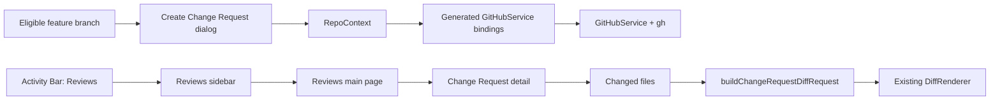

# Change Requests Implementation Plan

## Status

Proposed on 2026-07-21.

This document defines the first ControlZebra collaboration workflow for GitHub pull requests. The product calls them **Change Requests** in the normal interface, with GitHub terminology used only where it helps users understand an external GitHub state or link.

## Goal

Let a person working on an industrial project safely submit a branch for review, and let project collaborators inspect team and personal Change Requests through ControlZebra's existing file and visual diff viewers.

The first release must make the normal path obvious:

```text
Create a work branch -> save and push changes -> create Change Request -> inspect changes -> act on GitHub's review outcome
```

The feature should remain understandable for users who do not think in Git terminology while preserving GitHub as the collaboration authority.

## Product Decisions

| Decision | Direction |
| --- | --- |
| Hosting service | GitHub only for the first release. |
| Primary users | Both people submitting changes and people inspecting others' changes. |
| User-facing name | Change Requests. Use "Pull Request" only as contextual GitHub terminology. |
| Navigation | Dedicated `Reviews` activity-bar view, disabled until a Git repository is open. |
| First-release capabilities | Browse open Change Requests, create one, inspect its summary and changed files. |
| Review actions | Read-only in the first release. Formal approve/request-changes actions are a later phase. |
| Merge | Show GitHub merge readiness and blockers only. Do not merge in the app initially. |
| Target branch default | Preselect the repository default branch, normally `main`; allow the user to choose another remote branch. |
| Source branch | The currently checked-out local branch. It must be pushed to the GitHub remote before creation. |
| Repository boundary | Create and inspect Change Requests only when the open project is connected directly to its primary GitHub repository. Fork and external-contributor requests are out of scope for the first release. |
| Review metadata | Show reviewers and approval state. |
| Industrial summary | Display a prominent plain-language summary of changed project files before detailed diffs. |
| Visual comparison promise | Every supported existing file viewer must compare the exact Change Request base and head snapshots before release. |
| Safety authority | GitHub is authoritative for permissions, approvals, and mergeability. ControlZebra adds local safety checks and clear recovery guidance. |

## Scope

### In Scope

- GitHub authentication, repository, and remote eligibility states.
- A `Reviews` view containing open `Team Change Requests` and `Your requests`.
- Create flow for the checked-out, pushed non-default branch.
- Inspection and creation only for requests in the current project's primary GitHub repository.
- Default target branch selection from GitHub repository metadata, with an editable remote-branch selector.
- Request detail: title, description, author, source/target branch, review/approval status, merge readiness, and changed-file list.
- An industrial summary grouped by file category, such as ladder logic, HMI/configuration, drawings/media, and other files.
- Reuse of the existing `DiffRenderer` request contract for text, image, PDF, 3D, and L5X comparison between request base and head refs.
- Refresh on entry, explicit user refresh, repository change, and after creating a request.
- Explicit messages and recovery actions for unavailable GitHub CLI, unauthenticated users, non-GitHub remotes, unpushed branches, and permission failures.

### Out Of Scope

- GitLab, Azure DevOps, Bitbucket, or a provider abstraction.
- Formal approvals, request-changes decisions, general comments, inline comments, labels, assignees, linked issues, checks/CI dashboards, drafts, merge queues, or in-app merge execution.
- Local branch checkout from a Change Request.
- Viewing or creating Change Requests that originate from a fork or other external repository.
- Replacing GitHub's branch-protection model or creating a separate approval system.
- A background notification service. A visible refresh affordance is sufficient for the initial release.

## Existing Architecture To Reuse

| Existing seam | Reuse in Change Requests |
| --- | --- |
| `services/github_service.go` | Own all `gh` command execution and typed GitHub result mapping. It already uses `CommandRunner` and is exposed through Wails. |
| `frontend/bindings/controlzebra/services/githubservice.ts` | Generated bindings for new exported service methods. Regenerate; never edit generated files manually. |
| `frontend/src/domain/repo/context/RepoContext.tsx` and `RepoContext.types.ts` | Own view-ready state, loading/error transitions, and toast behavior for the new workflow. |
| `frontend/src/widgets/layout/ActivityBar.tsx` | Add the repository-gated `Reviews` navigation item. |
| `frontend/src/widgets/layout/Sidebar.tsx` and `view-registry.ts` | Register the sidebar and main-page halves of the dedicated view. |
| `frontend/src/features/explorer/components/ExplorerView.tsx` | Add a contextual action for an eligible pushed feature branch; do not duplicate request creation business logic there. |
| `frontend/src/viewers/registry/diff-request-adapters.ts` | Build comparison sides from the Change Request base and head refs, following existing merge-review behavior. |
| `frontend/src/viewers/components/shared/DiffRenderer.tsx` | Render each selected Change Request file with the existing specialized viewer registry. |

## Solution Design

### Domain Contract

Add transport-oriented Go models in `services/github_service.go`. They should intentionally reflect only data the first-release UI needs.

```go
type GitHubChangeRequest struct {
    Number              int                  `json:"number"`
    Title               string               `json:"title"`
    Body                string               `json:"body,omitempty"`
    URL                 string               `json:"url"`
    State               string               `json:"state"`
    IsDraft             bool                 `json:"isDraft"`
    Author              GitHubChangeAuthor   `json:"author"`
    HeadRefName         string               `json:"headRefName"`
    HeadRefOID          string               `json:"headRefOid"`
    BaseRefName         string               `json:"baseRefName"`
    BaseRefOID          string               `json:"baseRefOid"`
    ReviewDecision      string               `json:"reviewDecision"`
    MergeStateStatus    string               `json:"mergeStateStatus"`
    IsCrossRepository   bool                 `json:"isCrossRepository"`
    CreatedAt           string               `json:"createdAt"`
    UpdatedAt           string               `json:"updatedAt"`
    Reviewers           []GitHubChangeReviewer `json:"reviewers"`
}

type GitHubChangeRequestFile struct {
    Path       string `json:"path"`
    PreviousPath string `json:"previousPath,omitempty"`
    Status     string `json:"status"`
    Additions  int    `json:"additions"`
    Deletions  int    `json:"deletions"`
}
```

Use dedicated result wrappers for every query/mutation, including `Success`, data, `Message`, and `Error`, matching the existing service style. Do not expose raw `gh` JSON directly to React.

The frontend should maintain separate lightweight view models in `RepoContext.types.ts` only if Wails-generated model types are awkward for UI grouping. Avoid parallel copies of backend parsing rules.

### GitHub CLI Operations

All commands must use `g.runner` and `GhPath()`; no direct `os/exec` calls outside existing special authentication handling.

| Method | Command shape | Purpose |
| --- | --- | --- |
| `GetChangeRequestRepository(repoPath)` | `gh repo view --json nameWithOwner,defaultBranchRef,url` | Verify that `origin` resolves directly to the project's primary GitHub repository and obtain the authoritative default branch. |
| `ListChangeRequests(repoPath)` | `gh pr list --state open --limit 100 --json ...` | Load open requests available for the current repository. Separate `Team Change Requests` and `Your requests` client-side using authenticated username and request author. |
| `GetChangeRequest(repoPath, number)` | `gh pr view <number> --json ...` | Load detail, reviewers, approval decision, base/head refs, and merge status. |
| `ListChangeRequestFiles(repoPath, number)` | `gh api repos/{owner}/{repo}/pulls/{number}/files --paginate` | Load every file's path, rename information, status, additions, and deletions. Map REST fields `filename`, `previous_filename`, and `status` into the typed result. |
| `CreateChangeRequest(repoPath, options)` | `gh pr create --base <base> --head <head> --title <title> --body <body>` | Create a request after all preflight checks pass. |
| `ListRemoteBranches(repoPath)` | Existing GitService remote-branch query for `origin` | Populate valid target branches from the primary remote only. |

For the first release, the project's primary GitHub repository is the repository resolved from the local `origin` remote. Projects without an `origin` remote, or whose `origin` cannot be resolved by GitHub CLI, are not eligible. `GetChangeRequestRepository` must use the repository path as its command working directory, resolve and retain `nameWithOwner`, and use `--repo owner/name` for every subsequent `gh pr` and `gh api` operation. It must not infer repository ownership from the current account or a string-parsed remote URL.

Use one consistent `--json` field set and decode it into small internal command structs before mapping to exported types. Decode REST file results into a separate internal type before mapping `filename`, `previous_filename`, and `status` to exported file fields. This isolates GitHub CLI and API field spelling, pagination, and nullability from the Wails contract.

### Eligibility And Safety

The frontend may offer an entry point only when all conditions are true; the backend must repeat the durable checks needed for command safety.

| Condition | UX behavior |
| --- | --- |
| No open Git repository | Hide request-specific content and disable Reviews navigation. |
| GitHub CLI unavailable | Explain that GitHub tools are required and point to the existing setup flow. |
| Not authenticated | Show the existing device-flow connection action. |
| Current remote is not GitHub | Explain that Change Requests are currently available only for GitHub-connected projects. |
| `origin` is missing or is not the project's primary GitHub repository | Explain that Change Requests are available only from the project's primary GitHub connection in this release. |
| Current branch is default branch | Do not offer create; explain that a separate work branch is needed. |
| Sync is incomplete | Do not show the create action. Present `Sync` as the next action; creation must not silently push. |
| Existing open request for source branch | Open that request rather than creating a duplicate. |
| Source equals target | Block creation with a plain-language explanation. |

The create dialog derives its target default from GitHub's `defaultBranchRef.name`, falling back to the existing `MAIN_BRANCHES` list only when that metadata is unavailable. The visible selector remains editable and shows only remote branches that are valid targets.

For Change Request creation, `sync is complete` means all of the following are true: the source is not the default branch, the working tree and index are clean, the branch tracks `origin/<branch>`, and local `HEAD` equals that upstream commit after a refresh. The branch must therefore be neither ahead nor behind. Repeat this verification immediately before `gh pr create`; do not rely on the state that existed when the dialog opened.

The title must be required and trimmed. The description is optional. Do not introduce draft state or reviewer assignment in the first flow.

### Information Architecture

Add `VIEWS.REVIEWS` in `frontend/src/shared/constants/index.ts` and register it throughout the existing layout registry.



The sidebar should prioritize scanning and repeated use:

- `Team Change Requests`: open same-repository requests authored by someone else. Do not show or count requests whose source is a fork or another external repository. When any are omitted, show a neutral note that some external Change Requests are available on GitHub.
- `Your requests`: open requests authored by the authenticated GitHub user.
- A compact count and manual refresh control.
- Select an item to render its detail in the main area.

The main page should not be a generic GitHub clone. It should contain:

1. A compact header with title, request number, author, branch direction, update time, and `Open on GitHub`.
2. A clearly labeled status strip for review decision and GitHub merge readiness. These are informational in v1. Map review information to `approved`, `changes-requested`, `pending`, or `unavailable`; do not collapse an unavailable value into a pending or unapproved result. For `unavailable`, show `Review status not available yet.`
3. The description, when present.
4. An industrial change summary before the file list, for example `2 ladder logic files, 1 HMI configuration, 3 other project files`.
5. A changed-files table that retains GitHub add/delete counts and status.
6. Existing `DiffRenderer` content when a file is selected.

Use the existing shared dialog primitives for creation. Keep the creation dialog focused: source branch (read-only), target branch selector, title, description, and a final `Create Change Request` command.

### Diff Design

Add a `buildChangeRequestDiffRequest` adapter next to `buildMergeReviewDiffRequest`:

```ts
buildChangeRequestDiffRequest({
  repoPath,
  filePath,
  baseRef: changeRequest.baseRefOID,
  headRef: changeRequest.headRefOID,
  oldPath,
  fileStatus,
});
```

Use immutable base and head commit OIDs from the GitHub response rather than mutable branch names. This makes a selected review internally consistent even if remote branches move during the session. Refreshing the detail deliberately replaces the selected snapshot.

The adapter must preserve the existing added, deleted, renamed, copied, and modified side rules. It should pass normalized `oldSide` and `newSide` references to `DiffRenderer`, allowing L5X, image, PDF, and 3D review to remain on the shared specialized viewer path.

Before attempting a local ref-based diff, call a dedicated `EnsureChangeRequestSnapshotsLocal(repoPath, requestNumber, baseOID, headOID)` backend operation. It must fetch only from `origin`, store the request base and head under private ControlZebra refs, and verify that both resolved commits equal the OIDs returned by GitHub before the frontend opens a viewer. Never substitute working-tree files for a Change Request diff. Requests whose base or head cannot be materialized from the project's primary repository are unavailable in this release and must show a clear unsupported-state message.

### State And Refresh Ownership

`RepoContext` remains the only frontend integration facade for this feature. Add state that separates list refresh from selected-detail refresh:

- GitHub repository metadata and eligibility.
- Open Change Request list.
- Selected request number/detail and files.
- `isLoadingChangeRequests`, `isLoadingChangeRequestDetail`, and `isCreatingChangeRequest`.
- A structured recoverable error or empty state; do not use toasts as the only representation of a blocking state.
- Actions to load, select, create, clear, and refresh Change Request data.

Clear this state when the repository closes or changes. Reload the list after GitHub authentication changes, a repository remote refresh, explicit user refresh, and successful request creation. Do not add polling in the first release.

## Implementation Phases

### Phase 0: Contract And Test Harness

1. Confirm the installed `gh` version supports the required `pr` JSON fields on Windows and macOS, and confirm `gh api --paginate` can retrieve pull-request file metadata.
2. Define `origin` as the primary remote contract and add typed repository eligibility results for a missing, unresolved, or non-GitHub `origin`.
3. Add command-result mapping helpers that accept JSON bytes so they can be unit-tested without a live GitHub account.
4. Define Go result models and frontend request/detail UI types, including the stable review states `approved`, `changes-requested`, `pending`, and `unavailable`.
5. Add fixture-based Go tests for successful JSON mapping, missing optional fields, malformed JSON, human-readable CLI errors, renamed files, and paginated file results.
6. Regenerate Wails bindings once the exported types and methods are settled.

Exit criteria: model decoding is deterministic and bindings expose typed methods/models without manual generated-file edits.

### Phase 1: Repository Eligibility And List

1. Add `GetChangeRequestRepository` and `ListChangeRequests` to `GitHubService`, resolving `origin` once and passing its `owner/name` through every request.
2. Exclude cross-repository requests from the first-release list and expose an omitted-external count for the neutral list note.
3. Validate GitHub CLI/auth/repository eligibility and map each failure to a stable typed result.
4. Add RepoContext state and actions for repository eligibility and list loading.
5. Add `VIEWS.REVIEWS`, Activity Bar navigation, sidebar registration, main-page registration, and repo-change state cleanup.
6. Implement the list empty, loading, unauthenticated, non-GitHub remote, external-request note, and error states.
7. Add focused Go mapper/service tests and frontend context/view tests.

Exit criteria: an authenticated project connected directly to its primary GitHub repository shows open `Team Change Requests` and `Your requests`, while every unavailable state explains the next recovery step.

### Phase 2: Request Detail And Industrial Summary

1. Add `GetChangeRequest` and paginated REST-backed `ListChangeRequestFiles` backend methods.
2. Render selected request metadata, reviewer/approval state, description, and read-only merge readiness, preserving the `unavailable` review state.
3. Build a pure file-classification helper using the app's existing viewer/extension knowledge; return category counts and file membership.
4. Render the industrial summary and changed-file table before opening a diff.
5. Provide `Open on GitHub` using the existing external URL helper.
6. Add tests for reviewer/approval display, summary classifications, file status formatting, and selection/loading errors.

Exit criteria: a user can understand what changed before opening a file, then inspect the request without leaving ControlZebra.

### Phase 3: Read-Only Change Request Diffs

1. Add `buildChangeRequestDiffRequest` to the existing diff adapter module.
2. Add and call `EnsureChangeRequestSnapshotsLocal` before opening a diff. Fetch and verify same-repository base/head OIDs under private ControlZebra refs; do not proceed when verification fails.
3. Route the selected changed file through `DiffRenderer`.
4. Verify text, image, PDF, 3D, L5X, additions, deletions, and renames using existing viewer test fixtures. This is a release requirement, not a best-effort enhancement.
5. Preserve loading/error states for missing or fetch-unavailable refs; never fall back to working-tree comparison. Test initial absence of both request commits from the local object database.

Exit criteria: every supported existing diff viewer receives explicit immutable request sides and renders the same semantic comparison shown by GitHub for requests from the project's primary GitHub repository.

### Phase 4: Create Change Request

1. Add remote-branch loading and `CreateChangeRequest` to `GitHubService`.
2. Add duplicate-source-branch lookup before opening a create form; route a match to its existing request detail.
3. Add a reusable create dialog launched from the Reviews page and the eligible feature-branch Explorer state.
4. Preselect GitHub's default branch as the target and allow a remote-branch change.
5. Show the create action only after the checked-out non-default source branch satisfies the defined synced-branch rule. Recheck that rule immediately before creation. Use existing Sync/Push flows as recovery, not implicit side effects.
6. On success, show a concise confirmation, refresh the list, select the new request, and surface its GitHub URL.
7. Add tests for target defaulting, source/target validation, unpushed, behind, and uncommitted-work recovery, duplicate detection, successful creation, and service failures.

Exit criteria: a user can create exactly one well-formed request from their current pushed branch and immediately inspect it.

### Phase 5: Hardening And Documentation

1. Run cross-platform manual checks with directly connected GitHub user and organization repositories, private repositories, protected default branches, and branch names containing `/`.
2. Confirm local safety messages do not claim to override GitHub permission or protection decisions.
3. Add user documentation using Change Requests terminology and a brief explanation of the GitHub connection requirement.
4. Add developer documentation for the GitHub CLI field contract, generated-binding step, and diff-ref fetch assumptions.
5. Add the plan's implemented status and final scope to `docs/plans/summary/PLANS_SUMMARY.md` when the feature ships.

## File Checklist

### Backend

- `services/github_service.go`
- `services/github_service_test.go`
- `services/git_service.go` and its tests for `EnsureChangeRequestSnapshotsLocal` and private reference handling.

### Generated Bindings

- `frontend/bindings/controlzebra/services/githubservice.ts` (generated)
- `frontend/bindings/controlzebra/services/models.ts` (generated)

### Frontend State And Layout

- `frontend/src/domain/repo/context/RepoContext.tsx`
- `frontend/src/domain/repo/context/RepoContext.types.ts`
- `frontend/src/shared/constants/index.ts`
- `frontend/src/widgets/layout/ActivityBar.tsx`
- `frontend/src/widgets/layout/Sidebar.tsx`
- `frontend/src/widgets/layout/view-registry.ts`

### Frontend Feature Surface

- Add `frontend/src/features/reviews/` for the dedicated view, page, request list, detail, summary, file table, and create dialog.
- `frontend/src/features/explorer/components/ExplorerView.tsx`
- `frontend/src/viewers/registry/diff-request-adapters.ts`
- Reuse `frontend/src/viewers/components/shared/DiffRenderer.tsx`; avoid creating parallel specialized-diff components.

### Documentation

- Add a user-facing Change Requests guide under `docs/` when the feature is implemented.
- Add GitHub CLI and diff-contract notes to the applicable technical documentation.
- `docs/plans/summary/PLANS_SUMMARY.md` after implementation status changes.

## Validation

Run focused checks as each phase lands:

```bash
go test ./services/... -run 'TestGitHubService|Test.*ChangeRequest' -v
task common:generate:bindings
cd frontend && npm run typecheck
cd frontend && npm test -- --run src/features/reviews
```

Before merging the completed feature:

```bash
go test ./services/... -v
cd frontend && npm test
cd frontend && npm run ci:guards
```

Manual acceptance checks:

1. Reviews is unavailable without an open Git repository and explains missing GitHub prerequisites in-repo.
2. An authenticated project connected directly to its `origin` GitHub repository displays eligible open requests separated into `Team Change Requests` and `Your requests` groups, while fork and external requests are excluded and not counted.
3. A selected request clearly shows its source/target branches, reviewers, approval state, merge readiness, and an industrial file summary. Missing GitHub review information displays `Review status not available yet.`
4. Each supported file type compares the exact base/head request snapshots, including additions, deletions, and renames. This must pass before release.
5. Creating a request preselects the GitHub default branch, permits a valid alternate remote branch, appears only after sync is complete, and never pushes implicitly.
6. The flow rejects default-branch sources, branches that are ahead or behind, uncommitted work, identical source/target branches, duplicate open requests, and missing or non-primary `origin` connections with direct recovery guidance. It repeats the synchronized-branch check immediately before creation.
7. GitHub protection, permission, and mergeability messages remain visibly authoritative over ControlZebra's local safety guidance.

## Follow-On Phases

After the initial workflow proves stable, evaluate these separately:

1. Submit formal reviews: approve and request changes.
2. General and inline comments, with a deliberate treatment of binary and visual assets.
3. GitHub checks/CI and draft state.
4. In-app merge, only after mergeability, protected-branch policy, recovery, and post-merge local sync behavior are designed end-to-end.
5. Notifications or background refresh, only with a clear user-control and noise-management model.