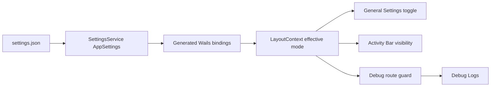

# Developer Mode Implementation Plan

## Status

Implemented on 2026-07-20. Developer Mode is persisted globally, its effective runtime state is owned by `LayoutContext`, and Debug Logs is the first gated developer-only surface.

Completed implementation:

- Added the backward-compatible `developerModeEnabled` application setting and regenerated Wails bindings.
- Replaced the local-only General Settings toggle with a persisted workflow, including safe disable behavior for active debug capture.
- Hid Debug Logs from the Activity Bar and Status Bar until Developer Mode is enabled, with a LayoutContext navigation guard as the backstop.
- Added focused backend and frontend regression coverage for persistence, hydration, settings failures, safe-off behavior, and visibility gating.

Validation completed:

- Focused backend settings tests pass.
- Focused Developer Mode frontend tests pass.
- `npm run ci:guards` passes.
- The full frontend suite currently has one unrelated failure in `src/widgets/layout/TitleBar.test.tsx`, whose expected `ControlZebra Beta` text no longer matches the rendered title bar.

## Goal

Provide an opt-in, app-wide Developer Mode that safely exposes internal diagnostics without changing the normal ControlZebra workflow for industrial users.

The first gated capability is **Debug Logs**. Future internal tools may use the same gate after they have a clear user and support purpose.

## Scope

### In Scope

- Persist Developer Mode in the global application settings file.
- Hydrate the setting at application startup.
- Keep the General Settings toggle synchronized with the persisted setting.
- Hide and prevent access to Debug Logs unless Developer Mode is enabled.
- Stop active debug logging when Developer Mode is turned off, after confirmation.
- Cover the persistence, navigation, and toggle behavior with backend and frontend tests.

### Out Of Scope

- Repository-specific developer settings.
- A generic remote feature-flag system.
- Bypassing protected branches, confirmations, update safeguards, or any other product safety behavior.
- Automatically enabling debug logging when Developer Mode is enabled.
- Moving production-only diagnostics behind an undocumented flag.

## Product Decisions

| Decision | Direction |
| --- | --- |
| Scope | Global to the installed app, not tied to a repository. |
| Default | Disabled for new installs and existing settings files. |
| Persistence key | `developerModeEnabled` in `settings.json`. |
| First gated surface | Debug Logs activity-bar item, view routing, and debug-status entry points. |
| Debug capture | Remains a separate explicit control. Enabling Developer Mode does not begin capture. |
| Safe-off behavior | If capture is active, confirm that disabling Developer Mode will stop logging before completing the change. |
| Failure behavior | Leave Developer Mode unchanged and show a clear error if settings cannot be saved or debug logging cannot be stopped. |

## Architecture



### Durable Setting

Add the following field to `AppSettings` in `services/settings_service.go`:

```go
DeveloperModeEnabled bool `json:"developerModeEnabled"`
```

Set its default to `false` in `defaultAppSettings()` and assign that default in `decodeAppSettings()` before unmarshalling. This preserves backward compatibility when older `settings.json` files do not contain the new field.

Run `task common:generate:bindings` after the Go model changes. The generated `frontend/bindings/controlzebra/services/models.ts` file must not be edited manually.

### Runtime State

`LayoutContext` is the right owner for the effective runtime value because it already controls global UI state, including navigation and theme. Add:

- `developerModeEnabled: boolean`
- `setDeveloperModeEnabled(enabled: boolean): void`

On provider startup, load `GetAppSettings()` once. Until loading completes, treat Developer Mode as disabled. If the request fails, keep it disabled and do not expose developer-only surfaces.

Do not add a separate provider for this one preference. Extract a dedicated developer-tools provider only when multiple independently managed developer preferences require it.

### Saving From General Settings

Replace the current local-only toggle state in `GeneralSettings` with the LayoutContext value. Follow the existing auto-download update pattern:

1. Capture the previous effective value.
2. Read the latest `AppSettings` before saving so concurrent persisted fields are retained.
3. Save the settings object with the updated `developerModeEnabled` field.
4. Update LayoutContext after the save succeeds.
5. Restore the previous effective value and show a toast if the save fails.

Disable the toggle while application settings are still loading or while the change is in progress.

## Debug Logs Gating

### Visibility

- Include `VIEWS.DEBUG` in the Activity Bar only when `developerModeEnabled` is true.
- Hide any Debug Logs-specific Status Bar entry point when the mode is disabled.
- Keep the debug service registered; this feature gates UI access, not service availability.

### Navigation Guard

Enforce the gate in `LayoutContext.setActiveView`, not just in navigation controls. If a caller requests `VIEWS.DEBUG` while Developer Mode is disabled, retain the current non-debug view. This protects future buttons, keyboard paths, and direct internal callers from reaching a hidden surface.

If Developer Mode is turned off while Debug Logs is active, switch the active view to `VIEWS.SETTINGS` after the setting change succeeds.

### Safe-Off Flow

Before disabling Developer Mode, query the debug service's existing enabled state.

- If debug logging is off, persist the setting immediately.
- If debug logging is on, show a confirmation dialog explaining that logging will stop.
- On confirmation, call `SetEnabled(false)`, then persist `developerModeEnabled: false`.
- If stopping logging or saving settings fails, keep Developer Mode enabled and report the failure. Do not leave an active capture session hidden behind a disabled developer UI.

## Implementation Phases

### Phase 1: Settings Contract

1. Add `DeveloperModeEnabled` to `AppSettings` and its defaults in `services/settings_service.go`.
2. Add Go tests for default settings, legacy JSON without the field, and save/load round trips.
3. Regenerate Wails bindings and verify `AppSettings` exposes `developerModeEnabled`.
4. Update `docs/technical/backend/services/SettingsService.md` with the current settings contract.

### Phase 2: Effective Runtime State

1. Add the value and setter to `LayoutContext`.
2. Hydrate the effective value from `GetAppSettings()` at startup, defaulting safely to `false` on failure.
3. Add a route guard for `VIEWS.DEBUG`.
4. Add tests for default-disabled and hydrated-enabled behavior.

### Phase 3: Settings Workflow

1. Replace the dummy toggle in `GeneralSettings` with the persisted workflow.
2. Reuse the current shared `Switch`, `Button`, toast, and confirmation dialog primitives.
3. Add the safe-off confirmation and stop active debug logging when confirmed.
4. Add frontend tests for save success, save failure rollback, and safe-off behavior.

### Phase 4: Gate Debug Surfaces

1. Filter Debug Logs from `ActivityBar` when disabled.
2. Guard or hide Debug Logs controls in `StatusBar`.
3. Redirect from Debug Logs to Settings after Developer Mode is disabled.
4. Verify Debug Logs remains available immediately after enabling the mode.

## File Checklist

### Backend And Bindings

- `services/settings_service.go`
- `services/settings_service_test.go`
- `frontend/bindings/controlzebra/services/models.ts` (generated)

### Frontend

- `frontend/src/context/LayoutContext.tsx`
- `frontend/src/features/settings/components/GeneralSettings.tsx`
- `frontend/src/features/settings/components/GeneralSettings.test.tsx`
- `frontend/src/widgets/layout/ActivityBar.tsx`
- `frontend/src/widgets/layout/StatusBar.tsx`
- Add or extend focused Activity Bar and Layout Context tests.

### Documentation

- `docs/technical/backend/services/SettingsService.md`
- `docs/plans/summary/PLANS_SUMMARY.md`

## Validation

Run the focused checks after each phase:

```bash
go test ./services/... -run 'Test(GetAppSettings|SaveAndGetAppSettings)' -v
cd frontend && npm test -- --run src/features/settings/components/GeneralSettings.test.tsx
cd frontend && npm run typecheck
```

Before merging the complete feature:

```bash
go test ./services/... -v
cd frontend && npm test
cd frontend && npm run ci:guards
```

Manual acceptance checks:

1. A clean install and an older settings file both start with Developer Mode disabled.
2. Enabling the mode persists across restart and reveals Debug Logs.
3. Disabling the mode hides Debug Logs and prevents direct navigation to it.
4. Disabling the mode while capture is active requires confirmation and stops capture.
5. A save or service failure leaves the previously active mode visible and usable.
