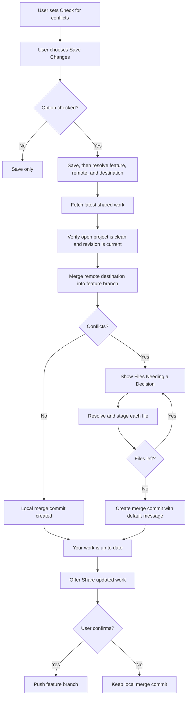

# Feature Branch Conflict Resolution Pivot Plan

> When the user opts in while saving, fetch the latest shared work, merge it
> into the feature branch in the open project, resolve any conflicts there,
> create the merge commit automatically, and ask before sharing it.

## Status

Pivot action plan, 2026-08-22.

This plan replaces the prepared-result design implemented in Phases 0-4 of the
former **Isolated Pre-Merge Conflict Readiness Action Plan**. The existing code
is the migration baseline, not the target architecture.

The target behavior follows this workflow in the open project:

```bash
git fetch <remote>
git merge --no-edit <remote>/<destination>
# resolve and stage conflicted files
git commit --no-edit
git push <remote> <feature-branch>            # only after user confirmation
```

Every command continues to run through `CommandRunner`. The commands above
describe behavior, not direct `os/exec` call sites.

## Approved Scope

| Decision | Approved choice |
| --- | --- |
| Outcome | Permanently merge the destination into the actual feature branch. |
| Destination | Fetch and merge the latest remote destination. |
| Fetch policy | Fetch only after an opted-in Save Changes succeeds. |
| Trigger | A **Check for conflicts** checkbox below Save Changes. Unchecked means save only; checked means save, then start the workflow. |
| Working copy | Use the open project only. Do not create or discover linked worktrees. |
| Commit | Create a regular merge commit automatically with Git's default message after all decisions are staged. |
| Push | Ask before pushing. Never push automatically after Save Changes. |
| Merge strategy | Regular merge only. Remove squash support from this workflow. |
| Migration | Replace the prepared-result session design rather than adding a second mode. |

## Product Consequence

This pivot deliberately reverses the former plan's central invariant.

Previously, ControlZebra merged the feature into a detached checkout of the
local destination, stored a private prepared result, and moved the destination
only when the user chose **Finish**. Neither user branch moved during review.

Now, ControlZebra merges the fetched remote destination into the actual feature
branch. A conflict-free merge immediately creates a local merge commit. A
conflicting merge leaves the open project in a real interrupted merge until the
user resolves or cancels it.

The feature branch is already checked out in the open project when Save Changes
runs. The workflow always uses that project and is not isolated. Ordinary Save
Changes must be disabled while Conflict Review is active.

## Target Workflow



### User-Facing Terms

| Internal action | User-facing term |
| --- | --- |
| Fetch remote destination | Check for shared updates |
| Merge destination into feature | Update your work |
| Unmerged files | Files Needing a Decision |
| Abort merge | Cancel update |
| Merge committed locally | Your work is up to date |
| Push feature branch | Share updated work |

UI text must not expose checkout, ref, index, HEAD, SHA, or merge-commit terms.
Errors have two parts: what happened, then a concrete recovery action.

## Safety Model

One update attempt captures:

```text
repository common directory
feature branch ref and pre-merge revision
remote name
remote destination ref and post-fetch revision
open project path
```

Required invariants:

- One common repository has at most one active update.
- Fetch completes before the remote destination revision is captured.
- The open project is clean and its feature revision is current before the
      merge starts.
- Automatic update never pushes.
- Conflict APIs accept only files in the real unmerged index.
- Final resolution uses `git commit --no-edit`, not `commit-tree`.
- Cancel before commit runs `git merge --abort` and verifies the feature ref,
  index, and files against the captured pre-merge revision.
- Cancel is not offered after the merge commit exists. Rewind is separate.
- The workflow never creates, discovers, locks, or removes linked worktrees.
- Cancel restores the open project in place; cleanup never removes it.
- Push verifies that the feature branch still points to the completed result.
- Frontend APIs continue to use session IDs and repository-relative paths only.

## Save Option

Add a **Check for conflicts** checkbox directly below the Save Changes button.
It is optional and unchecked by default.

- Unchecked: Save Changes ends after the user's work is saved.
- Checked: after Save Changes succeeds, start this workflow immediately.
- A failed Save Changes never fetches or starts a merge.
- The checkbox is disabled while saving or while Conflict Review is active.
- The workflow uses the repository and feature revision produced by that exact
      Save Changes operation; it is not scheduled by a general repository event.

Run a fresh porcelain status check immediately before merge. If the open
project is no longer clean, enter `blocked` without starting a merge. Do not
hold a Go mutex during human conflict review; persisted session ownership is
the long-lived guard and the shared repository coordinator protects short
transitions.

## Session Lifecycle

```text
scheduled -> fetching -> starting
  -> needs-decisions -> committing -> updated
  -> updated -> sharing -> shared
  -> blocked -> scheduled | cancelled
  -> needs-decisions -> cancelling -> cancelled
  -> any nonterminal state -> failed
```

`ready`, `applying`, `completed`, `obsolete`, `MergeMode`, and `HasResult` are
prepared-result concepts and are removed.

## Current Implementation Audit

### Reuse

| Existing area | Reuse |
| --- | --- |
| `repo_identity.go` and `repo_coordinator.go` | Common-repository identity and short transition locks. |
| `integration_session_store.go` | Atomic persistence and opaque IDs; bump its schema. |
| `integration_session_conflicts.go` | Session file gates, stale-event handling, and resolver delegation. |
| `classifyConflictQueue` | Real unmerged-entry classification. |
| `git_conflict_resolution.go` | Tokens, path checks, file protections, and staging. |
| Integration context and conflict UI | Session/event adapter and presentation. |

### Replace Or Delete

| Current implementation | Pivot |
| --- | --- |
| `resolveTarget` captures a local destination without fetching. | Fetch, then capture the remote-tracking destination. |
| Scheduler calls `PrepareReadiness(repoPath, true)` after every save. | Delete automatic scheduling. The Save Changes UI explicitly calls `UpdateFeatureFromDestination(repoPath)` only when the checkbox is checked. |
| Workspace is detached at `DestinationOID`. | Delete session workspace creation and use the open project. |
| `prepare` merges source into destination. | Merge remote destination into feature. |
| Conflict code swaps ours/theirs for the old direction. | Remove swaps after direction tests verify feature as ours and shared destination as theirs. |
| `createResult` uses `commit-tree` and a private ref. | Delete; use normal merge completion. |
| `FinishSession` applies a prepared result to destination. | Delete; add explicit `ShareSession`. |
| Cancel deletes a harmless detached review. | Abort and verify an interrupted merge in the open project. |
| Recovery never moves a ref. | Reconcile real merge state; abort only on explicit user cancellation. |
| Finish modal applies prepared work. | Show update status, Conflict Review, Cancel update, and Share updated work. |

## Backend API Target

| Method | Contract |
| --- | --- |
| `UpdateFeatureFromDestination(repoPath)` | After an opted-in save, fetch and start or complete a regular merge in the open project. |
| `ListSessions(repoPath)` | List sessions for the common repository. |
| `GetSessionState(sessionID)` | Return one complete update snapshot. |
| `GetSessionConflicts(sessionID)` | Return the real conflict queue. |
| Existing session resolution methods | Resolve and stage a queued file in the open project. |
| `CancelSession(sessionID)` | Abort and verify an interrupted merge in the open project. |
| `ShareSession(sessionID)` | After explicit confirmation, push the unchanged completed feature revision. |
| `RecoverSessions()` | Reconcile records, refs, and the open project's merge state without automatic branch movement. |

Fetch, merge, commit, and push use the service's five-minute `CommandRunner`
timeout and noninteractive environment.

## Persistence Migration

Bump the session schema. Never reinterpret schema-v1 prepared-result records as
active branch merges. On first startup:

1. Verify ownership and remove schema-v1 detached workspaces.
2. Delete `refs/controlzebra/integration/<sessionID>`.
3. Delete metadata only after cleanup succeeds.
4. Never apply a schema-v1 prepared result or move a user branch.
5. Persist a recoverable failure when cleanup cannot be verified.

New records include `remoteName`, `remoteDestinationRef`,
`remoteDestinationOID`, `featureOIDBeforeMerge`, `featureOIDAfterMerge`,
`openProjectPath`, and `pushState`.

## Pivot Phases

### Phase P0 - Contract And Git Harness

- [ ] Prove fetch plus regular merge into the checked-out feature branch.
- [ ] Verify first parent is the pre-merge feature and second parent is the
      fetched destination.
- [ ] Prove conflict staging plus `git commit --no-edit` and full restoration
      through `git merge --abort`.
- [ ] Prove staged, unstaged, and untracked work blocks before merge.
- [ ] Cover fetch/auth failures, branch movement, hook failure, and push
      rejection.
- [ ] Decide and test hook behavior. Normal merge and commit run project hooks
      unless explicitly disabled.
- [ ] Add plain-English state message tests.

Exit: focused harness tests pass on macOS.

### Phase P1 - Target And Open Project Merge

- [ ] Fetch and capture the remote destination.
- [ ] Delete checkout-owner discovery and managed workspace creation.
- [ ] Require the open project to be on the feature branch saved by the user.
- [ ] Validate clean porcelain status immediately before merge.
- [ ] Remove squash mode from model, API, bindings, and tests.
- [ ] Run `git merge --no-edit <remote-destination-ref>`.
- [ ] Remove ours/theirs translation after direction tests pass.

Exit: the open project can reach updated or needs-decisions; it never pushes.

### Phase P2 - Resolution, Commit, Cancel, And Recovery

- [ ] Point conflict operations at the open project.
- [ ] After the last decision, re-scan and run `git commit --no-edit`.
- [ ] Verify topology and feature ref before state `updated`.
- [ ] Redefine cancellation as merge abort plus restoration verification.
- [ ] Reconcile real merge state across restart.
- [ ] Test crashes around merge, decisions, commit, abort, and cleanup.
- [ ] Clean schema-v1 sessions without applying prepared results.

Exit: restart preserves review, cancellation fully restores, and completed
updates survive cleanup.

### Phase P3 - Explicit Share And Frontend Pivot

- [ ] Replace readiness and Finish calls with update state and `ShareSession`.
- [ ] Add the unchecked-by-default **Check for conflicts** checkbox directly
      below Save Changes.
- [ ] Start the workflow only from a successful Save Changes when checked;
      remove the repository-event trigger and debounce.
- [ ] Replace the Finish modal's prepared-result assumptions.
- [ ] Disable ordinary Save Changes while the open project needs decisions.
- [ ] Retain text, ladder, and whole-file resolution UI.
- [ ] Confirm Cancel update with the restoration consequence.
- [ ] Offer **Share updated work** only after state `updated`.
- [ ] Leave local update intact after push rejection and allow retry.
- [ ] Route active sessions correctly across project switching.

Exit: no UI says Finish or implies that the destination branch will move.

### Phase P4 - Delete Prepared-Result Infrastructure

- [ ] Delete result creation/application, private result refs, detached
      destination workspaces, worktree ownership code used only by sessions,
      and the integration-session scheduler.
- [ ] Remove prepared-result states, fields, and squash mode.
- [ ] Remove the Developer Mode gate after acceptance tests pass.
- [ ] Regenerate bindings and update technical documentation.

Exit: no active integration-session code references `commit-tree`,
`integrationResultRef`, `FinishSession`, or `integrationModeSquash`.

### Phase P5 - Hardening

- [ ] Test LFS, filters, hooks, submodules, large files, renames, and deletes.
- [ ] Test auth expiry, force-updated/deleted remote destinations, offline retry,
      and non-fast-forward push rejection.
- [ ] Test disk exhaustion, Windows paths/locks, restart, and project switching.
- [ ] Execute the Windows checklist and run full backend/frontend suites.

## Acceptance Criteria

- Fetch precedes remote destination capture.
- Each checked, successful Save Changes starts at most one regular merge of the
      remote destination into the actual feature branch.
- Conflict-free updates create a local merge commit automatically.
- Conflict decisions come only from real unmerged entries; the final decision
  automatically creates the default merge commit.
- Commit parents are feature-before-update, then fetched destination.
- Unchecked Save Changes never fetches or starts conflict checking.
- Checked Save Changes starts the workflow only after the save succeeds.
- The open project is always used; this workflow never creates a linked
      worktree.
- Dirty work blocks before merge and is never overwritten.
- Cancel restores the exact pre-merge feature state.
- Completed local updates are not silently rewound.
- Push requires explicit confirmation; failure leaves a retryable local update.
- No temporary branch, private prepared-result ref, or Finish application path
  remains after migration.
- Session paths never cross the frontend boundary.
- Restart and project switching preserve active conflicts.
- Backend and frontend test suites pass.

## Non-Goals

- Rebase or squash.
- Updating the destination branch.
- Automatic push after Save Changes.
- Temporary ControlZebra branches.
- Silent stash, discard, or overwrite.
- Predicted conflicts as decision items.
- More than one active update per open project.

## Explicit Risks

1. The normal open-project path is no longer isolated.
2. An opted-in Save Changes moves the feature branch and creates a commit.
3. Normal merge completion may run project-controlled hooks.
4. Automatic fetch must remain noninteractive and translate auth failures.
5. External branch/ref movement requires repeated revision validation.

These risks are accepted for planning by the approved workflow, but recovery
must be proven before removing the Developer Mode gate.

---

## Historical Implementation Baseline

The remainder of this document records the superseded prepared-result plan and
the delivered Phases 0-4. It is retained for migration traceability only. Its
decisions, architecture, future Phase 5, acceptance criteria, and open questions
are no longer authoritative.

This plan supersedes the merge-generated conflict lifecycle in
[[Merge and Conflict Workflow Separation Plan]]. That plan remains relevant to
repositories opened with an existing interrupted operation, but a merge started
by ControlZebra must no longer place the open project into an unmerged state.

It builds on the classifier delivered by [[Conflict Queue Service Plan]] and the
file-specific decision tools in [[Text and Ladder Conflict Resolution Plan]].

## Approved Decisions

These were settled before implementation planning and are not open for
rediscussion inside a phase.

| Decision | Choice |
| --- | --- |
| Deprecation strategy | Feature-flag the session path behind Developer Mode, run both paths, delete the old path in Phase 5. |
| Destination resolution | Reuse `GitService.mergeTargetRef` for v1. No new per-repo destination setting. |
| Resolver UI | Reuse `frontend/src/features/conflict` components. Swap `repoPath` for `sessionId` in the data layer only. |
| Readiness fallback | Saving remains the primary background trigger. If the user opens Finish before a session exists, run the same squash readiness check on demand and show progress in the modal. Never fall back to the legacy preflight or live merge. |
| Windows verification | Manual verification checkpoints. No Windows CI in this plan. |
| Scope | Regular and squash merge, one active session per Git common repository, saved revisions only. |
| Apply primitive | Chosen from how the destination is being used, because no single command is correct for all three cases. Nothing has it checked out: `git update-ref <destinationRef> <resultOID> <destinationOID>`, a true compare-and-swap with no working files to disturb. The open project has it checked out: `git merge --ff-only <resultOID>`, which updates ref, index, and files together and refuses on its own rather than overwriting local work. Another linked worktree has it checked out: stop and report `blocked`. Proven in Phase 0 and Phase 2. |
| Destination revision | The local `refs/heads/<branch>` only. Readiness does not fetch, so a destination that exists only on the remote is not yet a destination and readiness stays silent. Revisited in Phase 4. |
| Branch after Finish | The user stays on the branch they were working on. Unlike `prepareMergeTargetBaseline`, Finish never checks out the destination. |
| Result creation primitive | `git commit-tree`. It takes explicit parents, gives exact control over regular and squash topology, and cannot run repository hooks. Proven in Phase 0. |

## Product Decision

Conflict readiness is part of feature development, not part of the Finish
workflow.

After each **Save Changes** on a feature branch, ControlZebra schedules an
authoritative integration check against that feature's destination. The check
runs a real merge in a backend-owned worktree:

1. A conflict-free result marks the feature **Ready to Finish** but changes
   neither branch.
2. A conflicting result publishes a non-blocking **Files Needing a Decision**
   queue. The user may resolve those files before choosing Finish.

Finish is always an explicit user decision. It reuses the prepared result only
after verifying that its source and destination revisions are still current.

The open project never enters a merge or unmerged state, even temporarily.
Predicted conflicts are not used as resolution items.

## Current Implementation Baseline

What exists today in `controlzebra-oss`, and what each piece becomes.

### Backend

| Existing code | Today's behavior | Disposition |
| --- | --- | --- |
| `services/conflict_queue_service.go` | Bound to the open repo. Debounced scan on `RepoEventBus`. Falls back to prediction when nothing is unmerged. Registered in `main.go` and emits `conflictQueue:changed`. | Keep for pre-existing interrupted repos. Remove the prediction fallback and `ConflictQueueSnapshot.TargetBranch`. |
| `classifyConflictQueue` in `services/conflict_queue_classifier.go` | Classifies real unmerged index entries for a repo path. | Reuse unchanged against the session workspace. This is the highest-value existing asset. |
| `predictConflictQueue` and `mergeTreeConflictRecords` | `git merge-tree --write-tree` simulation feeding the queue. | Delete in Phase 5. Explicitly forbidden as a decision source. |
| `GitService.GetMergeState` (`git_service.go:3340`) | Builds `gitDir := filepath.Join(repoPath, ".git")` and stats `MERGE_HEAD`, `SQUASH_MSG`, `CHERRY_PICK_HEAD`, `REVERT_HEAD`, `BISECT_LOG`, `rebase-apply`, `index.lock`. | Not worktree-aware. Must be rewritten on `git rev-parse --git-path` before the session path reuses it. |
| `services/git_conflict_resolution.go` | `GetConflictResolutionData`, `ResolveConflictWithContent`, `ResolveConflictWithDecisions`, `resolveConflictWithStage`, all keyed on `repoPath` and gated on `GetMergeState(repoPath)`. | Keep the eligibility, token, encoding, size, mode, atomic-write, and staging logic. Re-key the public entry points on `sessionId`. |
| `GitService.StartMerge` (`3709`), `StartMergeWithOptions` (`3856`), `prepareMergeTargetBaseline` (`3627`), `CompleteMerge` (`4859`), `CompleteSquashMerge` (`4216`), `AbortMerge` (`4240`) | Mutate the open checkout and can leave it unmerged. | Replaced by the session lifecycle. Delete in Phase 5. |
| `GitService.CheckBranchConflicts` (`5134`), `GetConflictSidesInfo` (`5309`) | Preflight prediction and side labelling for the modal. | Delete in Phase 5. Readiness replaces preflight. |
| `GitService.mergeTargetRef` (`4964`) | Resolves the branch the checked-out work merges into. | Reuse as the v1 destination resolver for readiness. |
| `GitService.ListMergeReviewFiles` (`1965`), `DiffMergeReviewFileRaw` (`2039`) | Read-only two-ref review listing and diff. | Keep. Retarget at the session's captured source and destination OIDs. |
| `services/repo_events.go` | `RepoEventBus` with `RepoMutationCommit` and friends. | Reuse as the readiness trigger. Add a post-save event carrying enough identity to debounce. |
| `changeRequestRepoLocks` in `services/change_request_snapshot.go` | Per-repo `sync.Map` mutex keyed on a normalized path, case-folded on Windows. | Precedent for the repository coordinator. Generalize rather than duplicate. |
| `changeRequestRefNamespace` (`refs/controlzebra/change-requests`) | Private ref namespace outside `refs/heads`. | Precedent for `refs/controlzebra/integration/<sessionID>` holding prepared results. |
| `services/data_paths.go`, `atomic_replace_unix.go`, `atomic_replace_windows.go` | XDG-compliant local data layout and atomic file replace. | Reuse for session metadata persistence. |

### Frontend

| Existing code | Today's behavior | Disposition |
| --- | --- | --- |
| `features/conflict/context/ConflictQueueContext.tsx` | Calls `SetRepository`, `ClearRepository`, and `Refresh`, and subscribes to `conflictQueue:changed`. | The single data-layer seam. Gains a session-backed source behind the flag. |
| `features/conflict/components/modal/*` and `components/sidebar/*` | Resolver pane, text and L5X resolvers, whole-file fallback, sidebar queue. | Reuse as presentation components. They must never receive a session id or workspace path; a thin session controller may adapt their existing file and action props. |
| `features/conflict/lib/conflict-queue-presentation.ts`, `types.ts` | Presentation mapping and decision payload helpers. | Reuse. Extend only if a new session state needs a label. |
| `features/merge/hooks/useMergeFlowController.ts` | `MergeFlowStep` of `check`, `review`, `resolve`, `complete`. Drives the live merge. | The `check` and `resolve` steps disappear. Replaced by a readiness hook. |
| `features/merge/components/ExplorerMergeModal.tsx`, `modal/MergeReviewPane.tsx`, `modal/TargetBranchDrawer.tsx`, `MergeReviewDiffModal.tsx` | Blocking merge modal with preflight and in-modal resolution. | Reduced to a Finish surface with read-only review and the reused session resolver when decisions remain. Legacy preflight and live-merge resolution are removed. |
| `features/explorer/pages/MergeRequestScreen.tsx` | Explorer sub-screen for the merge state. | Becomes the Ready to Finish and Needs Decisions surface. |
| `domain/repo/context/RepoContext.tsx` and `.types.ts` | Holds merge state, conflicted files, and merge actions. | Merge-state fields shrink to interrupted-repo recovery only. |
| `context/LayoutContext.tsx` `developerModeEnabled`, `services/settings_service.go` `AppSettings.DeveloperModeEnabled` | Existing Developer Mode flag with settings persistence. | The gate for the session path through Phase 4. |

### Confirmed Gaps

No existing code provides any of the following. All are net new.

- Linked-worktree creation, ownership locking, or lifecycle.
- Worktree-aware resolution of Git administrative paths.
- A repository coordinator shared across services that mutate refs.
- Persisted, restartable session state and startup reconciliation.
- Result creation that bypasses project-controlled commit hooks.
- A guarded application sequence for a checked-out destination.

## Deprecation Strategy

The old and new paths coexist from Phase 2 through Phase 4.

- Gate every session-path entry point on `AppSettings.DeveloperModeEnabled`,
  read through `useLayout().developerModeEnabled` on the frontend and through
  `SettingsService` on the backend.
- With the flag off, behavior is byte-for-byte today's behavior.
- With the flag on, `ExplorerMergeModal` never starts a live merge, and
  `ConflictQueueContext` reads from the session snapshot.
- No shared mutable state between the two paths. The session service must not
  write to `ConflictQueueService`, and vice versa.
- Phase 5 deletes the old path, removes the flag from this feature, and leaves
  Developer Mode itself in place for other tools.

Deletion order in Phase 5 matters: remove frontend callers first, regenerate
bindings, confirm nothing else fails to build, then remove Go methods.

## Architecture

```text
Save Changes on feature branch
  -> debounce and schedule readiness check
       -> capture source OID, destination ref/OID, and finish mode
            -> replace any older session for the same repository
                 -> create detached worktree at destination OID
                      -> run a real merge against source OID
                           -> no conflicts
                                -> persist prepared result
                                     -> show Ready to Finish
                           -> conflicts
                                -> publish non-blocking decision queue
                                     -> stage decisions in session workspace
                                          -> persist prepared result
                                               -> show Ready to Finish

Explicit Finish action
  -> verify prepared source and destination are still current
       -> validate destination checkout
            -> apply prepared result
                 -> refresh project and clean up
```

The temporary worktree is detached at the captured destination OID. The source
is also resolved to an immutable OID before execution. This preserves the
meaning of current and incoming versions even if branch names move later.

A worktree is preferred over a temporary index because text, ladder, image, and
future external-tool workflows need materialized files and normal Git conflict
stages. Although the operation is real, its result stays unreachable from the
source and destination branches until Finish succeeds.

## Readiness Semantics

Readiness is always scoped to this immutable tuple:

```text
(repositoryCommonDir, sourceOID, destinationRef, destinationOID, mergeMode)
```

The result answers one question: can this exact saved feature revision be
finished against this exact destination revision using the selected mode?

It excludes unsaved working-file edits. It is not a prediction based on path
overlap or `git merge-tree` output. It is the materialized outcome of the same
integration that Finish would otherwise run.

Any source or destination revision change invalidates the result. ControlZebra
replaces it with a fresh session after the next eligible trigger. The first
release does not reuse decisions from an invalidated session.

## Session Model

```text
sessionID
repositoryCommonDir
openProjectPath
workspacePath
operationKind
mergeMode
sourceRef
destinationRef
destinationOID
sourceOID
resultOID
state
generation
createdAt
updatedAt
```

`sessionID` is opaque and unguessable. Frontend APIs accept the session ID and
repository-relative file paths only. Temporary workspace paths never cross the
Wails boundary.

Repository identity is the canonical path from `git rev-parse --git-common-dir`,
not the caller's worktree path. This identity enforces the one-session limit
across linked worktrees and coordinates repository mutations.

Session metadata is written atomically under ControlZebra's local data directory
with restrictive permissions. The worktree is locked with an ownership reason so
ordinary pruning cannot remove an active review. Replaced sessions are marked
obsolete before workspace cleanup begins.

## Session Lifecycle

```text
scheduled -> preparing
  -> needs-decisions -> ready
  -> ready -> applying -> completed
  -> blocked -> applying | obsolete | cancelled
  -> obsolete -> cleaning
  -> failed -> scheduled | cancelled
```

`needs-decisions` exposes the non-blocking Conflict Review queue. `ready` means
the captured source and destination have a prepared result, but neither branch
has changed. `blocked` means the result is still current but the checkout is
temporarily unsafe to update. `obsolete` means a newer source or destination
requires a fresh session.

Cancellation is idempotent and never moves either ref.

## Finish Protocol

Finish consumes an already prepared result. An atomic ref update alone is not
valid for a destination checked out in the open project: it moves `HEAD` without
updating files or the index. Finish is a persisted, restartable protocol.

1. Verify the session is ready, has no unresolved queue entries, and has a
   persisted prepared result.
2. Verify the source ref still equals `sourceOID` and the destination ref still
   equals `destinationOID`.
3. Transition to `applying` without rebuilding the merge.
4. Acquire the repository coordinator and enumerate linked worktrees with
   `git worktree list --porcelain`.
5. Repeat OID validation while the coordinator is held, using compare-and-swap
   semantics for destination advancement.
6. Verify the destination checkout has no staged, unstaged, or untracked work
   the update could overwrite.
7. If another linked worktree owns the destination, stop without changing it.
8. Update the destination ref, index, and files through a guarded Git operation
   appropriate to the checkout that owns the destination.
9. Verify the destination ref, index, files, and expected result before marking
   the session `completed`.
10. Publish repository mutations, refresh the open project, and remove the
    temporary worktree idempotently.

Guarantees: compare-and-swap destination advancement, no silent overwrite of
local work, a persisted result before mutation begins, recovery at every
checkpoint, and cleanup only after verification. Direct `update-ref` against a
checked-out destination is forbidden.

## Refresh, Obsolete, And Blocked Reviews

If the source or destination no longer matches its captured OID, the old session
becomes `obsolete` and a fresh check is scheduled from the newest saved
revisions. Existing decisions are not reused. The user is told:

> Your saved work changed, so Conflict Review was refreshed. Review the latest
> files before finishing.

If unsaved, staged, or untracked work blocks Finish without moving either ref,
the result remains recoverable. The user is told what to save, move, or discard.
ControlZebra does not stash, discard, or overwrite that work.

---

# Phased Actions

Each phase lists targeted, verifiable actions against real files. A phase is
done only when its exit criteria pass.

## Phase 0 - Contract And Git Harness

Goal: prove the risky Git mechanics before any service code depends on them.

### Actions

- [x] Add a `newLinkedWorktreeRepo(t)` helper producing a repo with a checked-out
      destination and at least one linked worktree. It lives in
      `services/integration_git_harness_test.go` rather than
      `services/git_service_test.go`, and builds every scenario in code, so no
      `services/testdata/integration/` fixture directory was needed.
- [x] Add `services/integration_git_harness_test.go` proving, against real Git:
  - [x] `git worktree add --detach <workspace> <destinationOID>` plus
        `git -C <workspace> merge --no-commit --no-ff <sourceOID>` yields the
        expected unmerged index for a conflicting pair.
  - [x] Regular-mode result creation produces two parents in the expected order.
  - [x] Squash-mode result creation produces one parent and matches the tree of
        the equivalent `git merge --squash` outcome.
  - [x] Result creation runs with hooks disabled and does not execute a
        repository `pre-commit` or `commit-msg` hook planted by the fixture.
  - [x] The prepared result is unreachable from `refs/heads/*` until applied.
- [x] Add `services/integration_apply_test.go` proving the guarded application
      sequence against a destination that is checked out in the open project:
      ref, index, and working files all match the result afterwards. The
      primitive is `git merge --ff-only <resultOID>` run in the worktree that
      owns the destination.
- [x] Prove application refuses and reports `blocked` when the destination
      checkout has staged, unstaged, or untracked work at an affected path.
- [x] Prove application refuses when another linked worktree owns the
      destination.
- [x] Add interruption tests. Nothing is persisted until Phase 2, so Phase 0
      proves the Git-level invariant only: stopping after any step of the apply
      sequence, and a stale `index.lock`, leaves the destination fully applied or
      fully unapplied, never half-applied, and re-running converges. Recovery
      across persisted `applying` checkpoints is a Phase 2 test.
- [x] Write the user-facing outcome string for each of `scheduled`, `preparing`,
      `needs-decisions`, `ready`, `blocked`, `obsolete`, `failed`, `cancelled`,
      and `recovered`, following
      `.github/skills/user-facing-language/SKILL.md`. Two parts: what happened,
      then a concrete next step. No Git jargon. They live in
      `services/integration_session_messages_test.go` with tests enforcing both
      rules, so Phase 0 writes no production code. Phase 2 moves them into the
      service.
- [x] Record a manual Windows verification checklist in
      `docs/technical/testing/Isolated-Integration-Manual-Checks.md` covering
      linked worktrees, long paths, antivirus file locks, and interrupted
      application. Windows is manual-only.

### Exit Criteria

- [x] Every harness test passes on macOS via
      `go test ./services/... -run Integration -v`.
- [ ] The Windows checklist has been executed once manually and its results
      recorded in the document.
- [x] No service code has been written yet.

## Phase 1 - Worktree-Aware Foundations

Goal: remove `.git` path assumptions and add identity, coordination, and
persistence primitives.

### Actions

Delivered in two passes. Pass A is the worktree-aware foundation, Pass B is
session persistence and the workspace lifecycle.

#### Pass A - worktree-aware foundation

- [x] Add `services/git_admin_paths.go` with helpers wrapping
      `git rev-parse --path-format=absolute --git-path <name>`,
      `--git-common-dir`, and `--git-dir`, each returning an error rather than
      guessing. One `rev-parse` call resolves many names in order, so callers pay
      for one subprocess, not one per name.
- [x] Rewrite `GitService.GetMergeState` to use those helpers instead of
      `filepath.Join(repoPath, ".git")`. It now resolves all fourteen names in a
      single call and returns an empty state when the path is not a repository.
- [x] Audit every remaining `.git` string literal in `services/`. All seven
      sites in `git_service.go` were converted: `GetMergeState`, `AbortMerge`'s
      `SQUASH_MSG` cleanup, `GetBisectState`, `RemoveStaleLock`,
      `RemoveAllStaleLocks`, `CheckLockFile`, and `RemoveLockFile`. All fourteen
      sites in `repository_settings_service.go` were converted too, across
      `DiagnoseRepository` and `RemoveStaleLocks`. That file mattered more than
      it first appeared: git routes `HEAD.lock` to the worktree-specific
      directory while `config.lock` and `refs/heads` stay in the common one, so
      the old single `.git` join was wrong for every one of them from a linked
      worktree. Deliberately left untouched:
  - `git_service.go:87` in `DetectRepo` only tests `.git` for existence, and in a
    linked worktree `.git` is a file, so `os.Stat` still succeeds. Correct by
    accident, but correct.
  - `github_service.go` `.git` handling, which trims clone URLs and never
    touches the filesystem.
  - `RemoveStaleLocks` still globs `refs/heads/*.lock` at a single level, so a
    lock for a slash-named branch such as `feature/valve-timing` is missed. A
    pre-existing gap, unrelated to worktree awareness, left as-is on purpose.
- [x] Add `services/repo_identity.go` with a canonical common-directory identity
      function. It resolves symlinks so two routes to one repository agree, folds
      case on Windows, and caches per caller path because a repository never
      changes its common directory.
- [x] Add `services/repo_coordinator.go` generalizing `changeRequestRepoLocks`
      into a shared coordinator keyed on common-directory identity. Migrated
      `change_request_snapshot.go` to it so there is one lock table, not two.
      `lockChangeRequestRepo` survives as a thin wrapper, so its eight call sites
      are unchanged. Identity resolution failures fall back to the cleaned path
      key, so a git failure narrows the guarantee instead of skipping the lock.
      The coordinator serializes short start, apply, and cancel transitions only,
      never a human review period.

#### Pass B - persistence and workspace lifecycle

- [x] Add `services/integration_session_store.go` with atomic persistence under
      `data_paths.go`, restrictive permissions, `atomic_replace_*.go` for writes,
      and a schema version field. `DataLocations` gained `IntegrationDir`.
      Session ids are 128 bits of randomness, validated as hex before ever being
      used in a path. One unreadable or future-schema record is skipped rather
      than failing the whole listing, so a single corrupt file cannot hide every
      other active review.
- [x] Add `services/integration_session_workspace.go` owning detached worktree
      creation, `git worktree lock` with an ownership reason, ownership-marker
      validation, and idempotent removal that tolerates missing directories and
      retries Windows file-lock failures. `git worktree prune` is never used.
      The ownership marker lives in the worktree's administrative directory,
      outside the working tree, so it never appears as untracked content that
      could be swept into a resolution.
- [x] Add startup reconciliation in
      `services/integration_session_reconcile.go` that pairs persisted sessions
      with real worktrees and refs. A missing workspace, an unowned workspace, or
      a vanished result produces a persisted `failed` state with a plain-English
      reason. It never moves a ref.
- [x] Define and enforce preflight gates before materializing project content.
      Implemented as `checkIntegrationPreflight`:
  - Disk space: `git ls-tree -r -l -z` sums the destination tree, and creation
    requires twice that plus a 256 MB floor.
  - Windows path budget: the longest repo-relative path plus the workspace root
    must stay under `MAX_PATH`, enforced only when `core.longpaths` is off.
  - LFS: the workspace is created with the LFS smudge and process filters
    disabled via `-c`, so preparation stays fast on large projects.
  - Custom filters: left alone, so a resolved file matches the user's real
    working file.
  - Submodules: detected and recorded, never initialized or updated.

### Exit Criteria

- [x] `go test ./services/...` passes, including existing merge-state tests.
- [x] `GetMergeState` returns correct results inside a linked worktree.
- [x] Creating and cancelling a session leaves no worktree, no lock, no metadata
      file, and no ref behind.
- [x] Cancelling twice is a no-op the second time.

## Phase 2 - Isolated Readiness And Safe Finish

Goal: the backend can prepare and apply a result. No UI yet.

### Actions

- [x] Add `services/integration_session_service.go` with the service struct,
      `NewIntegrationSessionService(git *GitService)`, and `SetApp`. The
      constructor takes the `integrationMergeTarget` seam rather than the
      concrete type, matching `ConflictQueueService`, so the service is testable
      without a live repository. The Phase 0 outcome strings moved here from
      `integration_session_messages_test.go`, which kept its two rules as tests
      against the production map.
- [x] Register it in `main.go` next to `conflictQueueService`: construct it,
      give it the `repoEventBus`, add it to `Services`, call `SetApp` after
      `application.New`, and kick off `RecoverSessions` on a goroutine so an
      unfinished review from a previous run is reconciled before the user can
      act on it.
- [x] Capture the immutable tuple on session creation. The destination comes
      from `GitService.mergeTargetRef`, but only its branch name: that method
      prefers the remote-tracking ref, and Finish can only update a local
      branch. Readiness therefore captures `refs/heads/<branch>` and stays
      silent when no local branch exists.
- [x] Implement preparation: create the detached worktree, run the mode-specific
      merge with `--no-commit`, and classify the outcome with the existing
      `classifyConflictQueue`. Work already contained in the destination
      short-circuits to `ready` with the destination as its own result, so a
      no-op integration never creates an empty merge commit.
- [x] Implement result creation with hooks disabled, writing the result to
      `refs/controlzebra/integration/<sessionID>`, mirroring the private
      namespace pattern of `changeRequestRefNamespace`.
- [x] Implement the ten-step Finish protocol using the sequence proven in
      Phase 0. The prepared result is reused; the merge is never re-run. Steps 2
      and 5 both validate revisions on purpose: step 2 avoids taking the
      coordinator pointlessly, step 5 closes the race once it is held.
- [x] Implement `blocked` detection and its recovery path. A refusal keeps the
      prepared result, so Finish can simply be chosen again once the user has
      dealt with whatever was in the way.
- [x] Implement session replacement: mark the old session obsolete before
      cleanup, and drop late results by session ID and generation.
- [x] Publish repository mutations through `RepoEventBus` after a successful
      Finish so `ConflictQueueService` and the file watcher refresh. Both the
      open project and the working copy that owns the destination are announced.
- [x] Enforce one in-flight preparation per common repository.
- [x] Add `services/integration_session_service_test.go` covering create,
      prepare, conflict-free ready, conflicting needs-decisions, obsolete
      replacement, blocked, cancel, apply, and restart reconciliation. Both
      reachable apply paths are covered: destination checked out nowhere, and
      destination checked out in the open project after the user switched to it.

### Exit Criteria

- [x] A conflict-free readiness check reaches `ready` and changes no ref.
- [x] Finish applies the prepared result and the destination checkout's files,
      index, and ref all agree.
- [x] Every Phase 0 checked-out-destination assertion still holds when driven
      through the service rather than the harness.
- [x] Do not start Phase 3 until this exit criterion passes.

## Phase 3 - Session Queue And Resolution

Goal: route existing conflict tooling at the session workspace.

### Actions

- [x] Add `SessionConflictSnapshot` to the session service, in the new
      `services/integration_session_conflicts.go`:

  ```go
  type SessionConflictSnapshot struct {
      SessionID  string               `json:"sessionId"`
      Generation uint64               `json:"generation"`
      Entries    []ConflictQueueEntry `json:"entries"`
      ScannedAt  int64                `json:"scannedAt"`
      Error      string               `json:"error,omitempty"`
  }
  ```

- [x] Emit an `integrationSession:conflicts` event carrying that snapshot.
      `ConflictQueueService` was not touched and `conflictQueue:changed` was not
      reused, so the repository queue and the session queue can never overwrite
      each other. `prepare` now returns the entries it already classified, so
      reaching `needs-decisions` publishes the queue without a second scan.
- [x] Call `classifyConflictQueue` against the session workspace, unchanged.
      `predictConflictQueue` is not reachable from the session path.
- [x] Add session-keyed resolution entry points. All four share
      `resolveInSession`, which checks the file really is waiting for a decision,
      delegates, and republishes:
  - [x] `GetSessionConflictResolutionData(sessionID, relPath)`
  - [x] `ResolveSessionConflictWithDecisions(sessionID, relPath, token, decisions)`
  - [x] `ResolveSessionConflictWithContent(sessionID, relPath, token, content)`
  - [x] `ResolveSessionConflictWithSide(sessionID, relPath, side)`
- [x] Refactor the merge-state gate into a parameter. `conflictOperationActive`
      is now the only place that inspects the state, and each exported entry
      point is a one-line wrapper over a gate-free core taking `inOperation`.
      `resolveConflictWithStage` gained the same parameter, so its two callers in
      `git_service.go` keep the rebase-inclusive gate they always had.
- [x] Preserve every existing protection. Nothing inside
      `git_conflict_resolution.go` moved, so tokens, `safeRepoRelativePath`,
      encoding, size, mode, atomic write, and staging are literally the same
      code. Queue membership is an additional gate on top, not a replacement:
      a session id cannot reach a file the user was never shown.
- [x] Ignore late events whose session ID or generation does not match.
      `refreshSessionConflicts` reloads the record and drops anything whose
      generation moved or which is no longer awaiting decisions.
- [x] Require an empty real-conflict queue before result creation. The check
      lives inside `createResult`, so both callers are covered rather than each
      trusting its own earlier scan.
- [x] Do not reuse decisions from an obsolete session in this release.
- [x] Regenerate bindings with `task common:generate:bindings`.

### Exit Criteria

- [x] Text, ladder, and whole-file decisions all stage correctly in the session
      workspace and never touch the open project. Covered by
      `services/integration_session_conflicts_test.go`, which asserts both the
      open project and the linked worktree stay clean.
- [x] No frontend API accepts or receives a filesystem path outside the open
      repository. The entry points take a session id and a repository-relative
      path; `WorkspacePath` is resolved on the backend and never serialized.
- [x] A stale token is rejected with the existing error, unchanged.

## Phase 4 - Background Readiness Workflow

Goal: the user-visible workflow, behind Developer Mode.

### Actions

Delivered in two planned passes, followed by targeted wiring repairs found
during manual workflow review. Pass A is the data path, Pass B is the merge UI.

#### Pass A - background scheduling and the queue source

- [x] Emit a post-save repository event from the Save Changes path carrying
      repository identity. Nothing new was needed: `CommitAll` already publishes
      `RepoMutated{RepoPath, RepoMutationCommit}`, and the session service
      derives the common-directory identity from that path exactly as
      `PrepareReadiness` already did. Adding a parallel event would have
      duplicated identity resolution for no gain.
- [x] Implement debounced scheduling in the session service, in the new
      `services/integration_session_scheduler.go`. It mirrors
      `ConflictQueueService`: an `AttachToBus`/`DetachFromBus` pair, a per-path
      timer replaced on each trigger, and `afterFunc` injected for tests. Only
      `RepoMutationCommit` schedules; every other reason either cannot change
      what the destination would receive, or is Finish itself. The quiet period
      is one second rather than the queue's 150ms, because a save is a
      deliberate act and preparation is expensive.
- [x] Gate the automatic path on Developer Mode. The flag is read fresh from
      `SettingsService` on every trigger through the `integrationSettings` seam,
      so turning the flag off stops the next check with no invalidation wiring.
      With the flag off nothing runs: no worktree, no git calls.
- [x] Bound integration git calls at five minutes. The service's own
      `CommandRunner` carries the longer timeout, because both preparation and
      Finish materialize a whole tree and the 30-second default is wrong for a
      large LFS project. `preparing` surfaces immediately rather than after a
      delay, since the state is worded as non-blocking.
- [x] A scheduled check always assumes a squash finish, matching the product
      default. Choosing a regular finish instead no longer matches the captured
      tuple, so a fresh session is prepared on demand.
- [x] Add
      `frontend/src/features/integration/context/IntegrationSessionContext.tsx`
      holding session state, subscribing to both `integrationSession:conflicts`
      and `integrationSession:changed`, and exposing `finish`, `cancelReview`,
      `refresh`, on-demand readiness, and the four session-keyed conflict
      operations. A state change for a review it does not recognize triggers an
      authoritative re-read rather than a guess that the review belongs to the
      open project. Scans are ordered by `scannedAt`, since every snapshot for
      one session shares a generation.
- [x] Add a source switch inside
      `frontend/src/features/conflict/context/ConflictQueueContext.tsx`. This is
      the conflict data-layer seam. When the review is the source the provider
      also unbinds the repository queue, so the backend stops doing prediction
      work nobody reads.
- [x] Hoist `LayoutProvider` from `AppLayout.tsx` into `App.tsx` above the
      conflict providers. `useLayout` throws outside its provider, and
      `LayoutContext` imports nothing from `RepoContext`, so hoisting is safe
      and keeps one source of truth for the flag. Reading the setting a second
      time would have gone stale the moment the user toggled it.
- [x] Keep session identity out of every component under
      `features/conflict/components/`. `SessionConflictResolver` is the thin
      controller that maps session entries and operations into `ConflictQueue`.
      `ConflictQueue` gained a local display-file type for the richer session
      statuses, and `ConflictResolverPane` narrowed its file dependency to
      `{ path: string }`; neither component receives a session id or workspace
      path.
- [x] Hide predicted entries entirely when the flag is on. Unbinding the
      repository queue removes them at the source rather than filtering them
      in the UI.
- [x] Add `IntegrationSessionContext.test.tsx` and extend
      `ConflictQueueContext.test.tsx` to cover both sources.

#### Pass B - the merge UI

- [x] Render Ready to Finish, Files Needing a Decision, blocked, and checking
      states without navigating the user away from current work. Not in
      `MergeRequestScreen.tsx`: that file, along with `AllSyncedScreen`,
      `ReadyToPushScreen`, and `CommitScreen`, is exported from
      `features/explorer/pages/index.ts` but rendered nowhere, left behind by
      the frontend restructure. The live surface is `ExplorerView` feeding
      `ExplorerStatusPanel`, which gained one optional `review` prop and a
      state-aware title on the `featureBranch` panel. Files needing a decision
      were already covered by `ConflictQueueSection`, which Pass A made
      session-backed.
- [x] Reduce `ExplorerMergeModal.tsx` under the flag to a Finish confirmation.
      The reduced flow lives in the new `MergeFinishModal.tsx` and
      `ExplorerMergeModal` became a two-line switch on
      `useLayout().developerModeEnabled`. Two components rather than branches
      threaded through 1,315 lines, so Phase 5 deletes the legacy one whole.
      The new modal never calls `useMergeFlowController`, so no legacy preflight
      check or live merge can run. When the session is `needs-decisions`, it
      embeds `SessionConflictResolver` in the existing modal and stages choices
      only in the isolated workspace.
- [x] Add an on-demand readiness fallback for **I am ready to merge**. The
      button still only opens the modal, but an open `MergeFinishModal` with no
      active session asks `IntegrationSessionContext` to call
      `PrepareReadiness(repoPath, true)` exactly once. This covers saved work
      created before Developer Mode was enabled, before startup, or after an
      earlier review was removed. Existing sessions are reused, and the modal
      shows **Checking your saved work** instead of a blank review while the
      check runs.
- [ ] Trim `MergeFlowStep` in `useMergeFlowController.ts`. Deferred to Phase 5.
      The flagged path no longer uses the hook at all, so `check` and `resolve`
      are already unreachable when the flag is on, but the union cannot shrink
      while the legacy component still relies on both.
- [x] Retarget review at the session's captured source and destination OIDs.
      `loadMergeReviewFiles` and `loadMergeReviewFileDiff` already pass their
      arguments straight to `ListMergeReviewFiles` and `DiffMergeReviewFileRaw`,
      and a commit OID is a valid ref, so this was an argument swap with no
      context change. `MergeReviewPane` needed no retargeting either, being
      presentational; it gained one `selectable` prop so the file list can drop
      checkboxes that mean nothing when Finish applies the whole result.
      `MergeReviewDiffModal.tsx` was left alone: it has no importers anywhere in
      `frontend/src` and is Phase 5's to delete.
- [x] Add the refresh notice shown when a new saved revision discards prior
      decisions. Detected in the modal by the session id changing while it is
      open, because a replaced session is cancelled and cleaned up on the
      backend and so can never be shown as `obsolete`.
- [x] Add the Cancel Review confirmation that states decisions will be deleted
      and that neither branch changes.
- [x] Add `MergeFinishModal.test.tsx` for the reduced flow and
      `SessionConflictResolver.test.tsx` for session data loading, region
      decisions, and whole-file decisions. Extend
      `IntegrationSessionContext.test.tsx` to cover on-demand preparation,
      conflict loading, and the Developer Mode gate. The existing
      `ExplorerMergeModal.test.tsx` was left untouched and still passes, which
      is the evidence that the legacy path is unchanged.

### Exit Criteria

- [x] With Developer Mode off, behavior is unchanged and all existing frontend
      tests pass untouched.
- [x] With Developer Mode on, saving on a feature branch produces a readiness
      result without blocking the user.
- [x] With Developer Mode on, opening Finish without an existing session starts
      one readiness check and presents progress instead of an empty modal.
- [x] The open project stays editable while decisions are pending.
- [ ] Restart and project switching preserve an active review. Restart is
      covered by `RecoverSessions` and its Phase 2 tests; project switching
      through the running UI has not been exercised manually yet.

## Phase 5 - Deprecation, Migration, And Hardening

Goal: one path. Delete the old one.

### Actions - Frontend First

- [ ] Remove the Developer Mode gate for this feature and make the session path
      unconditional. Leave Developer Mode itself in place for other tools.
- [ ] Delete the live-merge branches from `useMergeFlowController.ts`,
      `ExplorerMergeModal.tsx`, and `TargetBranchDrawer.tsx`.
- [ ] Remove merge-state and conflicted-file fields from
      `frontend/src/domain/repo/context/RepoContext.tsx` and
      `RepoContext.types.ts` that only the old flow consumed. Keep what the
      interrupted-repo recovery banner needs.
- [ ] Remove the dual source from `ConflictQueueContext.tsx`, leaving only the
      session source plus the interrupted-repo source.

### Actions - Backend Second

- [ ] Delete `predictConflictQueue` and `mergeTreeConflictRecords` from
      `services/conflict_queue_classifier.go`, the `predict` call site and the
      `conflictQueueMergeTarget` seam in `services/conflict_queue_service.go`,
      and `TargetBranch` from `ConflictQueueSnapshot`.
- [ ] Delete `ConflictStatePredicted` and any presentation handling for it in
      `frontend/src/features/conflict/lib/conflict-queue-presentation.ts`.
- [ ] Delete `GitService.StartMerge`, `StartMergeWithOptions`,
      `prepareMergeTargetBaseline`, `CompleteMerge`, `CompleteSquashMerge`,
      `AbortMerge`, `CheckBranchConflicts`, and `GetConflictSidesInfo`.
- [ ] Delete the repo-keyed public conflict resolution entry points once the
      session-keyed ones are the only callers. Keep every internal helper.
- [ ] Keep `AbortCurrentOperation` and the recovery path for repositories opened
      with a pre-existing interrupted Git operation. That migration is out of
      scope.
- [ ] Regenerate bindings with `task common:generate:bindings` and confirm the
      frontend build has no unresolved imports.

### Actions - Hardening

- [ ] Exercise LFS-tracked files, custom clean and smudge filters, submodules,
      files above the 50 MB classifier limit, disk exhaustion, long Windows
      paths, antivirus locks, project switching, and application restart.
- [ ] Run the Phase 0 Windows manual checklist again and record results.
- [ ] Add `docs/technical/backend/services/IntegrationSessionService.md`, and
      update `GIT_WORKFLOWS.md`, the `ConflictQueueService` document, and
      `docs/plans/summary/PLANS_SUMMARY.md`.
- [ ] Mark [[Merge and Conflict Workflow Separation Plan]] as superseded except
      for its interrupted-repository recovery scope.

### Exit Criteria

- [ ] No code path can leave the open project unmerged as a result of a
      ControlZebra-initiated merge.
- [ ] `grep -rn "predictConflictQueue\|StartMergeWithOptions" services frontend`
      returns nothing.
- [ ] `go test ./services/...` and `cd frontend && npm test` both pass.

## Acceptance Criteria

- Save Changes schedules a readiness check for the feature's destination without
  blocking continued work.
- A readiness check never leaves the open project unmerged.
- A conflicting check creates one non-blocking, resumable Conflict Review.
- A conflict-free check marks the feature Ready to Finish and applies nothing.
- Regular and squash results have the expected parent topology and content.
- Current and incoming labels retain their existing meaning.
- The open project remains usable while decisions are pending.
- Unsaved files are excluded from readiness.
- Any source or destination ref change invalidates the prepared result and
  schedules a fresh check.
- Decisions from an obsolete review are not reused in the first release.
- Local staged, unstaged, and untracked work is never overwritten.
- Cancelling deletes the isolated result and leaves both branches unchanged.
- Only explicit Finish may apply a prepared result.
- Finish reuses the valid prepared result instead of rerunning the merge.
- Restart and project switching preserve an active review.
- Session paths are never accepted from or exposed to the frontend.
- No predicted conflict appears as an active decision item.
- Linked-worktree behavior passes on macOS and on the manual Windows checklist.
- Recovery is tested at every persisted `applying` checkpoint.

## Non-Goals

- Eliminating Git's internal unmerged state inside the isolated workspace.
- Reimplementing Git's merge engine.
- Reusing decisions from an obsolete review.
- Including unsaved working-file edits in readiness.
- Applying a conflict-free result before the user chooses Finish.
- Supporting multiple active reviews for one common repository.
- Silently stashing, discarding, or overwriting open project files.
- Migrating Sync or every pre-existing interrupted-operation workflow.
- Replacing existing conflict classifiers or file viewers.
- Using conflict prediction as the resolution foundation.
- Adding Windows CI.

## Open Questions

Answer before the phase that needs them, not before starting.

1. ~~Phase 1: where does the session worktree live?~~ Answered: under
   `DataLocations.LocalDataDir` in an `integration/` subdirectory, so
   `%LOCALAPPDATA%\ControlZebra\integration\` and
   `~/Library/Caches/ControlZebra/integration/`. The macOS cache directory can be
   cleared by the OS, and that risk is accepted: startup reconciliation already
   has to treat a missing workspace as a recoverable failure, so a purge lands on
   a path that must work anyway.
2. ~~Phase 2: on a fresh clone with no upstream, `mergeTargetRef` may report not
   ok. Does readiness stay silent, or does the UI prompt once for a
   destination?~~ Answered: readiness stays silent and creates no session.
   Nothing has gone wrong when there is no local destination branch, and
   prompting on a fresh clone would be noise. Phase 4 may add an affordance if
   real usage shows one is needed.
3. ~~Phase 4: how long may a preparation run before the UI reports progress
   rather than staying silent?~~ Answered: five minutes, applied to the session
   service's own `CommandRunner` so both preparation and Finish are covered.
   `preparing` surfaces immediately rather than after a delay, because its
   wording already tells the user to keep working. Large LFS repositories will exceed the 30-second
   `CommandRunner` default and need an explicit timeout, as
   `changeRequestFetchTimeout` already does.
4. Phase 5: should Finish reuse `ProgressService` for streaming progress, or is a
   session state transition enough?

**Related:** [[Conflict Queue Service Plan]] | [[Conflict Queue Sidebar Plan]] |
[[Merge and Conflict Workflow Separation Plan]] |
[[Text and Ladder Conflict Resolution Plan]]
