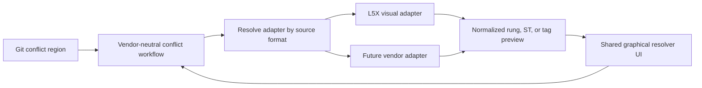

# Text and PLC Conflict Resolution MVP Plan

> Expand live merge conflict handling from whole-file choices to guided three-way resolution for text files, strict Git-region visualization for eligible PLC rung, structured-text, and tag conflicts, and whole-file fallbacks for every unsupported file. Rockwell L5X is the first supported PLC format.

## Status

Updated 2026-08-12.

- Phase 0 is implemented: the backend three-way conflict contract, safety checks,
  stage-aware whole-file fallback, atomic apply path, generated bindings, and
  temporary-repository tests are complete.
- Phase 1 is implemented: eligible text conflicts can be resolved by block or
  selected lines through the extracted `frontend/src/features/conflict` module,
  with in-memory drafts, composed preview, explicit apply, retry behavior, and
  queue advancement.
- Phase 2 is next: strict Git-region Rockwell L5X visualization for complete ladder rungs, structured text, and tags, behind a vendor-ready package boundary.
- Phase 3 remains the combined MVP hardening and cross-platform release gate.

Manual Windows runtime evidence for atomic replacement, CRLF behavior, and file
watcher reconciliation remains required before the combined MVP release. This is
release validation, not unfinished Phase 0 or Phase 1 implementation.

Implementation order:

1. Shared three-way conflict contract and backend safety harness.
2. Three-way text conflict engine and resolver.
3. Strict Git-region Rockwell L5X visualization with region-wide choices and a vendor-ready adapter boundary.
4. Integrated fallback, platform validation, and MVP release hardening.

These are implementation phases, not separate product releases. The first public release is not complete until all four phases pass the combined MVP exit gate.

## Goal

Let a non-technical user resolve a conflicted text file without leaving ControlZebra or understanding Git conflict markers.

The normal workflow should be:

```text
Select conflicted file
  -> review one true conflict region at a time
  -> choose Current or Incoming for the block
  -> optionally expand the block and choose individual lines
  -> resolve the file once every region has a choice
  -> move automatically to the next file
```

For `.l5x` files, the resolver should visually preview an eligible Git conflict region when each side contains one complete ladder rung, structured-text unit, or tag. The user chooses Current or Incoming for the entire region. The resulting file must remain valid L5X.

When ControlZebra cannot visualize or map an L5X conflict safely, it must always offer whole-file Current and Incoming choices instead of guessing. The text resolver may also be offered when the file is text-safe, but it is an optional advanced fallback and never replaces the required whole-file escape hatch.

## Approved Product Decisions

| Decision | Direction |
| --- | --- |
| Merge model | Three-way: base, current, and incoming. |
| Required decisions | Ask only for true conflict regions. Preserve Git's automatically merged content. |
| Text selection unit | Conflict block by default, expandable to individual lines. |
| L5X selection unit | One Git conflict region. Visual preview is available only when both sides contain one complete, same-kind RLL rung (including its comment), structured-text unit, or tag. |
| L5X choice meaning | A Current or Incoming visual choice selects that side's exact Git conflict-region text. The existing composer preserves Git's automatically merged context and never creates a hybrid region. |
| L5X preview strategy | Parse a temporary in-memory L5X wrapper around a self-contained region for preview only. The wrapper is never written or used in composed output. |
| Future PLC formats | Reuse the Git conflict workflow and normalized rendering models. Each vendor format supplies its own complete-fragment classifier, preview setup, and complete-document validation through a package adapter. |
| Manual editing | Not supported. The result is composed only from Current and Incoming selections. |
| Side labels | `Current` and `Incoming`. Do not use `Mine`, `Theirs`, `Ours`, or `Source` inside the detailed resolver. |
| Draft behavior | Keep choices in frontend memory. Write and stage only when the user selects `Resolve File`. |
| L5X validation | Block detailed resolution when the composed file cannot be parsed; retain whole-file Current/Incoming fallback actions. |
| L5X fallback | Whole-file Current and Incoming actions remain available for every L5X file, including partially visualized, ambiguous, invalid, or unsupported content. |
| Layout | Keep the decision queue on the left and use the right side as the full resolver. |
| Delivery | Build incrementally, but ship text, rung, tag, and whole-file fallback behavior together as one MVP. |

## Behavior Before Phase 0 And Phase 1

Before this plan was implemented, the live-conflict path was file-level only:

- the merge conflict queue rendered only whole-file choices
- `RepoContext.resolveConflict()` calls `ResolveConflictKeepOurs()` or `ResolveConflictKeepTheirs()`.
- `GitService` runs `git checkout --ours/--theirs -- <path>` and immediately stages the file.
- `fileResolutions` records one strategy per file and the queue advances to the next unresolved file.
- the ordinary text diff viewer parses a two-snapshot unified patch and is read-only.
- the L5X diff viewer parses two complete controllers and renders read-only controller, routine, rung, instruction, and text differences.

These read-only diff contracts are useful for display, but they are not a safe foundation for conflict composition. The new workflow needs the three unmerged Git index stages and an explicit resolution contract.

## Scope

### In Scope

- Live conflicts after `startMerge()` has produced unmerged index entries.
- UTF-8 text files, including UTF-8 BOM files, within a defined size limit.
- Existing text-viewer extensions such as `.md`, `.txt`, `.xml`, `.json`, source code, `.l5x`, and `.l5k`.
- Three-way content from Git index stages:
  - stage 1: common base
  - stage 2: current
  - stage 3: incoming
- Git-generated conflict boundaries with automatically merged context preserved.
- Block-level Current/Incoming choices.
- Optional line-level Current/Incoming inclusion inside one expanded conflict block.
- In-memory drafts for every opened conflicted file while the merge modal remains mounted.
- Atomic working-tree write followed by `git add` when the file is resolved.
- Whole-file Current/Incoming actions as shortcuts and fallbacks.
- Graphical Current/Incoming region choices for self-contained RLL rung, structured-text, and tag conflicts.
- Rung previews include the complete `<Rung>` element and its `<Comment>` when present.
- Read-only formatted structured text and tag detail/table previews for eligible regions.
- Whole-file Current/Incoming fallbacks that remain reachable from every L5X resolver state.
- Parse validation before an L5X result can be written and staged.

### Out Of Scope

- A freeform text or XML editor.
- Character-level selection.
- Selecting individual ladder instructions, operands, branch legs, tag properties, AOIs, modules, or data types.
- Automatically resolving semantically equivalent L5X changes.
- Reconstructing an L5X document from `NormalizedController`.
- Expanding a partial Git conflict to an enclosing rung, structured-text unit, or tag.
- Source-location indexes, entity identity matching, or source-span replacement across conflict boundaries.
- Persisting unfinished drafts across modal closure, merge abort, app restart, or repository change.
- Reusing the resolver for pre-merge review, history, Change Requests, or ordinary working-tree diffs.
- Binary conflict composition.
- Non-UTF-8 text editing in the first release.
- Changing the existing merge strategy or completion workflow.

## Safety Invariants

The implementation must preserve these rules:

1. Git remains the authority for base, current, incoming, and conflict boundaries.
2. Resolution data comes from the live index entries, not branch tips or the conflict-marker working file.
3. Automatically merged content is not turned into an unnecessary user decision.
4. The frontend never writes repository files directly.
5. The backend verifies that the unmerged index entries are unchanged before applying a draft.
6. A file is not considered resolved until the composed content is written and `git add -- <path>` succeeds.
7. Invalid L5X content cannot be staged through the ladder resolver.
8. The normalized ladder model is never serialized back into L5X.
9. Unsupported, binary, oversized, deleted, encoding-unsafe, or ambiguous files retain whole-file fallback actions.
10. Closing or aborting the merge cannot silently apply an in-memory draft.
11. A graphical ladder, structured-text, or tag choice selects the exact Current or Incoming Git conflict-region text. It never expands a boundary, splices an XML entity, or creates a hybrid region.
12. Whole-file fallback remains available before apply for every L5X file and discards any detailed draft only after explicit confirmation.
13. Choosing a missing side in a delete/modify conflict stages the deletion instead of attempting to check out a nonexistent blob.

## Architecture

### Keep Resolution Separate From Read-Only Diffing

Do not add mutating props to `DiffRenderRequest` or turn the global viewer registry into an editor registry. Read-only diffs are used in history, explorer, merge review, and Change Requests; coupling resolution state into that contract would spread merge-only behavior across unrelated surfaces.

The implemented design keeps merge orchestration separate from a conflict-owned
resolver feature:

```text
features/merge/ExplorerMergeModal
  -> features/conflict/ConflictQueue
  -> ConflictResolverPane
       -> TextConflictResolver
       -> L5XConflictResolver (Phase 2)
       -> WholeFileConflictFallback
```

`ExplorerMergeModal` remains the workflow owner and holds ephemeral per-file
drafts. `features/conflict` owns conflict contracts, backend model mapping,
resolver UI, composition, and validation. The resolver may reuse visual
primitives and pure view models from the existing text and L5X viewers, but it
does not mutate the read-only viewer registry.

### Git Index Stage Contract

Add typed backend models in `services/git_service.go`:

```go
type ConflictBlob struct {
    Present bool   `json:"present"`
    OID     string `json:"oid,omitempty"`
    Mode    string `json:"mode,omitempty"`
    Content string `json:"content,omitempty"`
}

type ConflictRegion struct {
    ID       string   `json:"id"`
    Current  []string `json:"current"`
    Base     []string `json:"base,omitempty"`
    Incoming []string `json:"incoming"`
}

type ConflictSegment struct {
    Kind     string          `json:"kind"` // context or conflict
    Text     string          `json:"text,omitempty"`
    Conflict *ConflictRegion `json:"conflict,omitempty"`
}

type ConflictResolutionData struct {
    Success          bool              `json:"success"`
    Path             string            `json:"path"`
    Status           string            `json:"status"`
    Eligible         bool              `json:"eligible"`
    IneligibleReason string            `json:"ineligibleReason,omitempty"`
    Base             ConflictBlob      `json:"base"`
    Current          ConflictBlob      `json:"current"`
    Incoming         ConflictBlob      `json:"incoming"`
    Segments         []ConflictSegment `json:"segments,omitempty"`
    ResolutionToken  string            `json:"resolutionToken,omitempty"`
    Newline          string            `json:"newline,omitempty"`
    HasFinalNewline  bool              `json:"hasFinalNewline"`
    Error            string            `json:"error,omitempty"`
}
```

The exact generated TypeScript shape may use Wails model classes, but the frontend should map it immediately to merge-domain types in `RepoContext.types.ts` or a feature-local model.

Add two exported service methods:

```go
GetConflictResolutionData(repoPath string, filePath string) ConflictResolutionData
ResolveConflictWithContent(
    repoPath string,
    filePath string,
    resolutionToken string,
    content string,
) OperationResult
```

`GetConflictResolutionData` should:

1. verify a merge, squash merge, or supported live conflict operation is active
2. validate and normalize the repository-relative path
3. read `git ls-files -u -z -- <path>` and capture the stage 1, 2, and 3 mode/OID entries
4. read blobs by OID with `git cat-file blob <oid>` rather than interpreting user paths as revision syntax
5. classify the file by content, encoding, status, extension, and size
6. invoke Git's three-way file merge engine over temporary stage snapshots
7. parse the generated diff3 conflict regions into typed context/conflict segments
8. return a resolution token derived from path plus the stage mode/OID tuple

Use `git merge-file -p --diff3` with unique labels and a large marker size for region generation. Exit code `0` means Git merged the file without a remaining conflict, `1` means conflict regions were produced, and values greater than `1` are failures. Marker parsing must use generated labels, detect marker collisions in source content, and fail closed to whole-file fallback if the output cannot be parsed unambiguously.

Do not use the working-tree file as input. Its marker style is user-configurable, may already have been edited externally, and does not reliably contain the base section.

### Eligibility Rules

The detailed text resolver is available only when all of these conditions hold:

- the path still has unmerged index entries
- current and incoming blobs required by the conflict status are available
- all present blobs are valid UTF-8, optionally with a UTF-8 BOM
- no present blob contains NUL bytes
- each side and the composed output are below the configured limit
- the path matches the shared text-viewer extension set or passes a conservative backend text-content check
- conflict regions can be generated and parsed unambiguously

Start with a 2 MiB per-side and 4 MiB composed-output limit. Keep the constants named and covered by tests so they can be adjusted from evidence later.

Whole-file actions remain available for:

- binary files
- unsupported encodings
- oversized files
- delete/modify and both-deleted cases
- missing required stages
- marker collisions or merge-engine failures
- unsupported live operations

For `.l5x` files, whole-file actions are not limited to ineligible files. They remain available as explicit escape actions from the text, rung, tag, mixed-content, loading-error, and validation-error states. If detailed decisions already exist, selecting a whole-file action must explain that those draft decisions will be discarded and require confirmation.

Whole-file application must use index-stage presence rather than assuming both sides have blobs:

- when the selected side exists, write its exact blob and stage the path
- when the selected side represents deletion, remove the working-tree path and stage the deletion
- when both sides deleted the path, stage the deletion without presenting a nonexistent file preview
- directory/file conflicts, submodules, and unsafe symlink cases fail closed with a specific recovery message

The existing `ConflictFileStatus` frontend union must be reconciled with every status emitted by `GetConflictedFiles()`, including `both-deleted`. Do not let an unrecognized backend status disappear from the queue.

### Text Conflict Draft Model

The implemented feature-local draft model lives under
`frontend/src/features/conflict/`:

```ts
type ConflictSide = 'current' | 'incoming';

interface ConflictLineChoice {
  current: boolean[];
  incoming: boolean[];
}

interface ConflictRegionDecision {
  mode: 'unresolved' | 'block' | 'lines';
  side?: ConflictSide;
  lines?: ConflictLineChoice;
}

interface TextConflictDraft {
  path: string;
  resolutionToken: string;
  decisions: Record<string, ConflictRegionDecision>;
}
```

Rules:

- every true conflict starts unresolved
- `Use Current` selects the complete current block and clears incoming line choices
- `Use Incoming` selects the complete incoming block and clears current line choices
- expanding a block exposes separate Current and Incoming line lists
- line mode may include lines from both sides, but keeps each side's original order
- line mode never permits arbitrary text or line reordering
- an empty result for a conflict block is valid only after an explicit `Remove this block` action or explicit deselection of all expanded lines followed by confirmation
- collapsing an expanded block preserves its line decisions
- `Resolve File` stays disabled until every conflict region has an explicit decision

Composition is a pure frontend function:

```ts
composeConflictResolution(segments, decisions): ComposeResult
```

It concatenates context segments exactly as returned by the backend and substitutes each conflict segment with the selected lines. It must preserve the backend-provided BOM, newline convention, and final-newline state. Add golden tests for LF, CRLF, BOM, and no-final-newline files.

### Apply Contract

`ResolveConflictWithContent` should:

1. repeat merge-state and path validation
2. reload the unmerged entries for the path
3. recompute and compare the resolution token
4. reject a stale draft if any stage OID or mode changed
5. reject NUL content, invalid UTF-8, or output over the configured limit
6. create a temporary file in the destination directory
7. preserve the executable bit from the current stage when applicable
8. write, flush, close, and atomically rename the temporary file over the working-tree path
9. run `git add -- <path>`
10. return success only after staging succeeds

The repository-relative path validation must reject absolute paths and paths that escape the repository after cleaning. Symlink behavior must be tested explicitly; the method must not follow a working-tree symlink outside the repository.

If the write succeeds but `git add` fails, return a distinct recovery message: the composed working file exists but remains unresolved. Keep the draft in memory and allow retry. Do not mark `fileResolutions[path]` or advance the queue until the backend returns success and live merge reconciliation confirms that the path is no longer unmerged.

## Phase 0: Contract And Test Harness

Before changing the UI, lock the three-way backend behavior with real temporary Git repositories.

Status as of 2026-08-03: backend contract implemented in the last two commits (`5e453f6` and `74fb233`). The implementation lives primarily in `services/git_conflict_resolution.go`, with platform-specific atomic replacement helpers in `services/atomic_replace_unix.go` and `services/atomic_replace_windows.go`. Wails bindings have been regenerated, `both-deleted` is now part of the generated and frontend conflict status unions, and the existing file-level Current/Incoming actions now use stage-aware blob/deletion application instead of path checkout assumptions.

Actual implementation notes:

- `GetConflictResolutionData()` reads unmerged stage entries with `git ls-files -u -z -- <path>`, loads blobs by OID through `git cat-file blob`, classifies stage presence into `both-modified`, `both-added`, `both-deleted`, `deleted-by-us`, and `deleted-by-them`, and returns a resolution token derived from the normalized path plus stage mode/OID tuples.
- The backend exposes stable `ConflictFileStatus` and `ConflictIneligibleReason` wire values for generated TypeScript models. Current ineligible reasons include unsafe file type, missing side, file too large, binary content, unsupported encoding/content, line-ending mismatch, conflict-generation failure, and output too large.
- Text eligibility now rejects unsupported index modes, oversized blobs, NUL bytes, invalid UTF-8, conservative text-control-byte failures, missing current/incoming sides, and current/incoming final-newline disagreement before detailed resolution is offered.
- Conflict regions are generated from Git's merge engine with `git merge-file -p --diff3 --marker-size=32`, using token-derived Current/Base/Incoming labels. The parser preserves literal marker-like user content, detects generated-label collisions, preserves a leading UTF-8 BOM as context, and reports newline/final-newline metadata for the frontend composer.
- `ResolveConflictWithContent()` revalidates merge state, path safety, stage entries, the resolution token, output size, NUL content, and UTF-8 before writing. It writes to a same-directory temporary file, preserves the executable bit from the current stage, atomically replaces the destination, then stages with `git add -- <path>`.
- Atomic replacement uses `os.Rename` on Unix-like systems and `MoveFileEx(MOVEFILE_REPLACE_EXISTING | MOVEFILE_WRITE_THROUGH)` on Windows.
- Whole-file fallback now uses exact selected stage blobs. If the selected side is absent, it removes the working-tree path when needed and stages the selected deletion with `git rm --cached --ignore-unmatch`; both-deleted conflicts can be cleared without pretending a file exists.
- Path safety rejects absolute or escaping paths, direct symlink destinations, parent-directory symlink escapes, symlink index modes, submodule modes, and other unsupported file modes.
- Backend tests added in `services/git_service_test.go` cover the main real-repository contract: same-line conflicts, stale-token rejection, invalid apply content, BOM/CRLF/no-final-newline metadata, unsafe content, line-ending disagreement, oversized output, unusual filenames, multiple true regions, strict marker parsing, marker-label collision, stage-presence status mapping, both-added empty output, executable mode preservation, symlink safety, selected-side deletion, and both-deleted resolution.

Phase 0 status: implementation complete. Remaining release evidence is runtime
validation on a real Windows host for atomic replacement, file watcher behavior,
and CRLF handling; cross-platform source exists, but macOS-side review cannot
prove Windows runtime behavior.

Deliverables:

- `ConflictBlob`, `ConflictSegment`, `ConflictRegion`, and `ConflictResolutionData` Go models - done
- helper that reads and fingerprints unmerged index stages - done
- helper that invokes Git's merge engine and parses typed conflict regions - done
- explicit UTF-8, binary, size, newline, and path-safety rules - done
- generated Wails bindings for the new service methods and models - done

Backend test matrix in `services/git_service_test.go`:

- both branches edit the same line
- branches edit different lines and only the overlapping region requires a choice
- several conflict regions in one file
- both-added file with no base stage
- delete/modify and both-deleted fallback behavior
- empty file and empty selected result
- LF, CRLF, BOM, and missing final newline
- literal marker-like content
- UTF-16, invalid UTF-8, and NUL content
- per-side and output size limits
- executable file mode
- filename containing spaces, Unicode, leading dash, and colon
- path traversal and symlink escape attempts
- stale resolution token after an external index change
- no active merge and already-resolved file

Exit gate:

- backend tests prove that only true conflict regions become decisions and that unchanged stage fingerprints cannot be bypassed - backend side met by the new temporary-repository tests; keep Windows runtime acceptance as release evidence before MVP completion

### Phase 0 Action Plan

1. **Status: Done.** Finalized the shared conflict models, complete status union, stage-presence rules, resolution-token format, size limits, encoding rules, and reason-code enums before implementing UI behavior.
  **Implementation note:** The Go models and enums live in `services/git_conflict_resolution.go`; generated bindings now expose `ConflictFileStatus`, `ConflictIneligibleReason`, `ConflictBlob`, `ConflictRegion`, `ConflictSegment`, and `ConflictResolutionData` to the frontend.
2. **Status: Done.** Implemented repository-relative path validation and a helper that reads stage 1/2/3 mode and OID entries with `git ls-files -u -z`, then loads content by OID.
  **Implementation note:** Stage loading uses `git cat-file blob <oid>` and never reads branch tips or revision-path syntax for conflict content. Destination validation rejects path traversal and symlink escapes before writes.
3. **Status: Done.** Implemented Git-backed conflict-segment generation, newline/BOM detection, marker-collision detection, text eligibility, and deterministic stage fingerprinting.
  **Implementation note:** `git merge-file -p --diff3` remains the authority for true conflict regions, while the token-derived marker labels and strict parser fail closed to fallback when output cannot be trusted.
4. **Status: Done.** Implemented atomic content apply and exact whole-file apply, including selected-side deletion, executable mode, staging failure recovery, and stale-token rejection.
  **Implementation note:** Detailed apply writes through a same-directory temp file and stages only after atomic replacement. Whole-file apply now handles missing selected stages as deletions instead of assuming every side has a blob.
5. **Status: Done for backend handoff.** Added the temporary-repository test matrix and regenerated Wails bindings.
  **Implementation note:** The added tests cover the backend contract needed for the Phase 1 vertical slice. Keep manual Windows runtime validation as release evidence before the combined MVP ships.

## Phase 1: Three-Way Text Resolver

Status as of 2026-08-11: implementation complete. The backend methods and
generated TypeScript bindings exist, `ConflictFileStatus` includes
`both-deleted`, and the queue displays every backend status. `RepoContext`
exposes `loadConflictResolutionData()` and `resolveConflictWithContent()`.
Plain frontend contracts and generated-model mapping now live in
`frontend/src/features/conflict/types.ts`.

The resolver is implemented under `frontend/src/features/conflict` rather than
inside the merge feature. `ExplorerMergeModal` remains responsible for merge
workflow orchestration and token-keyed, per-file in-memory drafts. The conflict
feature owns `ConflictQueue`, resolver routing, text block and line decisions,
whole-file fallback UI, composition, and validation.

### Frontend Domain And State

Extend the merge context with narrowly scoped operations:

```ts
loadConflictResolutionData(path: string): Promise<ConflictResolutionData | null>;
resolveConflictWithContent(path: string, token: string, content: string): Promise<boolean>;
```

Keep draft decisions in the merge feature component, keyed by file path. Do not put every selected line into global `RepoContext`; the context should own backend loading/apply state and live merge reconciliation, while the modal owns ephemeral presentation drafts.

Invalidate a draft when:

- its resolution token changes
- the file no longer appears in `conflictedFiles`
- the repository changes
- the merge is aborted or completed
- the modal is unmounted

### Components

The implemented `ConflictQueue.tsx` retains the existing queue and auto-advance
semantics while hosting the resolver pane.

Add:

- `ConflictResolverPane.tsx` for eligibility, loading, error, and resolver routing
- `TextConflictResolver.tsx` for block and line decisions
- `TextConflictBlock.tsx` for one expandable conflict region
- `WholeFileConflictFallback.tsx` for existing whole-file choices
- `conflict-composer.ts` for pure composition and validation
- focused tests beside each component and utility

Desktop layout:

- retain the approximately 280 px decision queue
- let the resolver consume the remaining modal width and height
- keep the active path, status, unresolved-region count, and `Resolve File` action visible in a sticky resolver header/footer
- show context lines around the active region without requiring decisions on them
- distinguish Current and Incoming with restrained existing diff colors, text labels, and accessible icons; color alone is insufficient
- use checkboxes for individual line inclusion because line mode can include content from both sides
- provide `Previous conflict` and `Next conflict` navigation
- show `N of M conflicts decided` separately from the file queue count

Mobile or narrow layout:

- stack queue and resolver or collapse the queue into a file selector
- do not put two full text columns side by side when they cannot remain readable
- keep all controls reachable without overlapping the modal footer

### Whole-File Shortcuts

Eligible text files should still offer `Use all Current` and `Use all Incoming` as deliberate shortcuts. These actions populate every region decision, show the composed preview, and still require `Resolve File`; they must not call the existing immediate checkout methods directly.

Ineligible files continue to use immediate whole-file resolution through the existing backend methods. Rename their UI labels to `Keep Current File` and `Keep Incoming File` while leaving internal Git method names unchanged.

### Phase 1 Tests

Frontend tests should cover:

- loading and routing eligible versus fallback files
- one unresolved block disabling `Resolve File`
- block-level Current and Incoming selection
- expanding a block and selecting lines from both sides
- explicit empty-block behavior
- preserving line decisions through collapse and file navigation
- whole-file shortcut populating all decisions without applying immediately
- compose output for multiple conflicts and untouched auto-merged context
- stale-token response preserving the draft and requiring reload
- apply success updating `fileResolutions` and advancing once
- apply failure retaining the active file and decisions
- modal close/abort discarding drafts without writes
- keyboard and screen-reader labels for side choices and conflict navigation

Exit gate:

- representative `.md`, `.txt`, `.xml`, and source files can be resolved without exposing conflict markers
- backend and frontend tests pass
- a manual Windows and macOS pass verifies CRLF behavior and queue/resolver sizing

### Phase 1 Action Plan

1. **Status: Done.** Mapped generated backend models into merge-domain types and added only `loadConflictResolutionData` and `resolveConflictWithContent` to `RepoContext`.
  **Implementation note:** The plain frontend contract lives in `frontend/src/features/conflict/types.ts`. `loadConflictResolutionData()` maps generated Wails model classes immediately, returning mapped ineligible data when the backend provides it and `null` only when the call cannot complete. `resolveConflictWithContent()` delegates writes to the backend, preserves failure drafts by returning `false`, and reconciles live merge state before returning `true`.
2. **Status: Done.** Implemented the pure composer and completeness validator with golden tests for LF, CRLF, BOM, no-final-newline, multiple regions, and explicit empty blocks.
  **Implementation note:** `frontend/src/features/conflict/lib/conflict-composer.ts` now composes only complete, valid decisions, preserves backend-provided text boundaries, and requires an explicit remove decision for an empty conflict result. Focused Vitest coverage locks the requested newline, BOM, multi-region, line-selection, and stale/invalid-decision behavior.
3. **Status: Done.** Built the end-to-end eligible-text vertical slice with Current/Incoming block selection, a complete composed-file preview, explicit apply, live-index reconciliation, and queue advancement.
  **Implementation note:** `ExplorerMergeModal.tsx` owns per-file resolution data, token-keyed drafts, and retry state while the modal remains open. `ConflictResolverPane.tsx` routes backend-eligible text files to `TextConflictResolver.tsx` and every other state to `WholeFileConflictFallback.tsx`. The detailed path writes only through `resolveConflictWithContent()` after `Resolve File`; immediate fallback uses the existing stage-aware whole-file methods with `Keep Current File` and `Keep Incoming File` labels. Focused component and modal tests pass alongside frontend type checking and the production build.
4. **Status: Done.** Added multi-region navigation, block decisions, expanded line selection, explicit empty-block confirmation, per-file draft retention, and whole-file shortcuts.
  **Implementation note:** The resolver now shows one active conflict at a time with Previous/Next navigation and surrounding auto-merged context. `TextConflictBlock.tsx` owns complete Current/Incoming choices and expandable checkbox-based line selection; entering line mode preserves an existing complete-side choice, collapsing preserves selected lines, and removing a section requires an explicit confirmation. Sticky `Use all Current` and `Use all Incoming` shortcuts populate every region without applying the file and confirm before replacing existing detailed work. Modal-level tests prove drafts remain keyed by file while navigating the queue, and focused merge tests cover navigation, mixed-side lines, removal, shortcuts, preview composition, and apply gating.
5. **Status: Done for Phase 1 implementation.** Added loading and fallback routing, apply-error retry messaging, draft retention across file navigation, safe-close behavior, conflict navigation labels, and responsive queue/resolver layout.
  **Implementation note:** Focused resolver and modal tests cover the implemented interaction states. Analytics privacy review and broader end-to-end accessibility evidence remain part of Phase 3 release hardening.
6. **Status: Done for automated validation.** Focused conflict tests, merge-modal integration tests, frontend type checking, and production build validation pass.
  **Implementation note:** Manual Windows and macOS line-ending and sizing acceptance remains required by the combined MVP release gate. Phase 1 is implemented but is not a standalone product release; Phase 2 rung/tag resolution and Phase 3 hardening remain mandatory.

## Phase 2: Strict Git-Region L5X Visual Resolver

The MVP uses the existing Phase 1 Git conflict segments as the sole resolution and composition units. There is no `projectL5XConflictRegions()` API, source-location index, entity identity matching, or source-span replacement. This deliberately trades visual coverage for a small, auditable implementation that never changes Git's conflict boundaries.

### Core Constraint

Git remains authoritative for the Current, Base, Incoming, automatically merged context, and true conflict regions. For every `.l5x` conflict region, the package classifies the Current and Incoming region text independently:

1. both options must each be one complete, same-kind XML unit: an RLL `<Rung>` (including any `<Comment>`), a supported structured-text unit, or a `<Tag>`
2. each option is parsed only inside a minimal temporary L5X wrapper held in memory for preview
3. the visualizer renders the two parsed options and the user selects the Current or Incoming **region**
4. the Phase 1 composer inserts the selected original Git region text, unchanged, among Git's context segments
5. `L5XConflictVisualAdapter.validateComposedDocument(result)` validates the composed complete file through a direct `L5XParser` instance before apply

The wrapper is never written to the repository and is not used in composition. It exists only to give the existing parser enough structural context for preview. The normalized model remains display-only and is never serialized back to L5X.

### Package-Owned Contract

Add a pure, non-React classifier and preview-model API in the `ladder-visualizer` package. It accepts one Current/Incoming Git region pair and returns either a same-kind visual model or a plain fallback reason. It does not accept the complete L5X documents and does not return source offsets.

```ts
type L5XConflictRegionKind = 'rung' | 'structured-text' | 'tag';

interface L5XVisualConflictRegion {
  kind: L5XConflictRegionKind;
  current: NormalizedRung | NormalizedTag | StructuredTextPreview;
  incoming: NormalizedRung | NormalizedTag | StructuredTextPreview;
}

interface L5XVisualConflictFallback {
  reason: 'incomplete-unit' | 'mixed-unit-kind' | 'unsupported-unit' | 'invalid-fragment';
}

classifyL5XConflictRegion(currentSource, incomingSource):
  | L5XVisualConflictRegion
  | L5XVisualConflictFallback;
```

The package owns complete-fragment recognition, safe in-memory wrapping, parsing, same-kind enforcement, and construction of the existing rung, formatted structured-text, and tag-detail display models. It must not use regular expressions to locate or replace XML elements. A narrow structured XML fragment parser is permitted only to prove that a region contains one complete supported unit; it does not need source locations.

### Vendor-Ready Boundary

The Git conflict queue, draft decisions, composer, atomic apply, and whole-file
fallback are vendor-neutral and remain outside `ladder-visualizer`. The shared
resolver UI consumes normalized preview data only; it never receives XML,
vendor parser objects, or source that could be written back to the repository.

Phase 2 implements an L5X-first adapter, but the package boundary must allow a
future vendor to supply its own fragment grammar and validation without changing
the merge workflow or visual resolver UI:

```ts
type VisualConflictKind = 'ladder' | 'structured-text' | 'tag';

interface ConflictVisualAdapter {
  readonly format: string;

  classifyRegion(
    currentSource: string,
    incomingSource: string,
  ): VisualConflictRegion | VisualConflictFallback;

  validateComposedDocument(source: string): ValidationResult;
}
```

`L5XConflictVisualAdapter` owns the L5X-only facts: `<Rung>` plus its complete
`<Comment>` is a ladder unit, `<Tag>` is a tag unit, L5X structured-text
elements define supported structured-text units, and a temporary
`RSLogix5000Content` wrapper is required for preview. A future adapter may use
a different XML envelope, JSON object, text grammar, or no wrapper at all.
Every adapter returns normalized preview data and preserves original source for
the existing composer; it must never serialize a normalized model to produce a
resolution.



The existing `NormalizedRung`, `NormalizedRoutine`, and `NormalizedTag` models
are the reusable display boundary. They are sufficient for the first adapter,
but their Rockwell-shaped instruction syntax, routine kinds, and tag categories
must be reconsidered only when a second vendor's real export fixtures establish
a concrete mismatch. Do not generalize those types speculatively during the L5X
MVP.

### Strict Eligibility And Fallback Rules

A visual region is eligible only when both Current and Incoming are self-contained, complete instances of the same supported unit type:

- RLL: one `<Rung>` including its complete `<Comment>` when present; the ladder preview renders the whole rung and comment as one unit.
- Structured text: one supported complete structured-text unit, rendered as plain formatted code.
- Tag: one complete `<Tag>`, rendered as a read-only detail card or table.

Resolve the region in the Phase 1 text view when either option is partial XML, contains more than one supported unit, mixes unit kinds, cannot be parsed by the temporary wrapper, belongs to an unsupported L5X area, or has an unsupported structured-text representation. Do not expand a partial conflict to its enclosing rung, comment, tag, or routine. Whole-file Current/Incoming actions remain visible throughout every L5X state.

### Desktop Components

Add a conflict-owned `L5XConflictResolver.tsx` that reuses:

- `buildInlineDiffModel()` and `InlineDiffRung` for modified-rung comparison
- `VirtualizedLadderDiagram` for single-sided added/removed rung context
- existing ControlZebra ladder themes
- package-owned height measurement and virtualization patterns
- the existing tag-table and tag-diff presentation for controller and program tags

Each visual region card provides exactly two actions:

- `Use Current`
- `Use Incoming`

The label identifies the previewed unit, for example `Current rung` or `Incoming tag`, but the action always selects the entire Git region. Do not make SVG instructions or individual tag properties clickable. A selection marks exactly one region as decided; the shared Phase 1 composer remains the source of truth for apply and validation.

### Phase 2 Tests

Package tests in `ladder-visualizer`:

- one complete RLL rung region per side, including a comment, CDATA, branches, and escaped XML content
- one complete tag region per side, including descriptions, CDATA, multiple `Data` formats, and unsupported child XML
- one supported complete structured-text region per side
- partial rung, comment, tag, and structured-text regions use the text resolver without expansion
- multiple units in one region, mixed rung/tag regions, and unequal unit kinds use the text resolver
- malformed and unsupported region fragments use the text resolver
- composed output uses the chosen original region text and parses as L5X

Desktop tests:

- `.l5x` eligible file routes to ladder resolver
- complete visual-region choice composes the selected side's exact original Git region text
- rung preview includes its complete comment; tag preview preserves source details absent from `NormalizedTag` because it is not serialized
- no instruction-level choice controls are rendered
- no individual tag-property choice controls are rendered
- unsupported regions use the existing text resolver and retain whole-file fallback
- invalid composed L5X disables detailed apply and explains the whole-file fallback
- valid composed L5X calls the same phase 1 apply method
- successful apply advances the existing decision queue once

Exit gate:

- real Studio 5000 fixtures with complete rung, structured-text, and tag regions resolve to parseable L5X
- partial, mixed, and unsupported regions route to the text resolver without boundary expansion
- no normalized-controller serialization, source-span replacement, or regex XML splicing exists in either repository

### Phase 2 Action Plan

1. **Status: Done.** Proved `L5XConflictVisualAdapter` as a narrow, structured complete-fragment classifier against focused L5X fixtures containing rung comments, CDATA, escaped content, structured text, and multiple tag data formats.
  **Implementation note:** The exported `ConflictVisualAdapter` contract lives in `ladder-visualizer/src/conflict/`. `L5XConflictVisualAdapter` directly instantiates `L5XParser`, classifies exactly one complete Current/Incoming `<Rung>`, `<Tag>`, or `<Line>` pair, and rejects partial, multiple, malformed, and mixed-kind regions. The focused package test covers preview and direct complete-document validation without global `parseString()` AOI-registration side effects.
2. **Action:** Implement temporary in-memory L5X wrappers and the pure Current/Incoming same-kind preview contract without changing ordinary `parseString()` behavior.
  **Project manager note:** The wrapper enables existing parsing and rendering while preserving the original Git region source for composition.
3. **Action:** Add package tests for eligible complete regions and fallback classification for partial, multiple, mixed-kind, malformed, and unsupported regions.
  **Project manager note:** Fixture evidence must prove that every selected output remains the exact original Git region text, never normalized or reconstructed XML.
4. **Action:** Build the Desktop L5X resolver with rung diagrams, formatted structured-text cards, tag detail cards, region-wide actions, Phase 1 text routing, parse validation, and persistent whole-file actions.
  **Project manager note:** The interface must make clear that the choice applies to the displayed conflict section, without exposing XML or internal Git terminology.
5. **Action:** Reuse the shared composer and prove a visual selection marks exactly one region as decided, composes unchanged selected region text, validates, stages, and advances the queue once.
  **Project manager note:** No L5X-specific composer or XML replacement path is permitted.
6. **Action:** Run package tests, type checking, library build, Desktop feature tests, and linked-package integration validation.
  **Project manager note:** Phase 2 is complete only when the package and its actual Desktop consumer pass together.

## Phase 3: Integrated Fallback And MVP Release Hardening

### Phase 3 Action Plan

1. **Action:** Make `Keep Current File` and `Keep Incoming File` visible and functional in every L5X resolver state, including partial visualization, loading failure, parse failure, stale draft, and unsupported content.
  **Project manager note:** This is a direct client requirement and the guaranteed recovery path. It should be tracked as an acceptance criterion, not treated as secondary error handling.
2. **Action:** Add confirmation and draft-reset behavior when a whole-file action replaces existing rung, tag, or text decisions.
  **Project manager note:** Users must understand that detailed work will be discarded. The confirmation prevents accidental loss while keeping recovery to one deliberate action.
3. **Action:** Verify delete/modify, both-deleted, directory/file, symlink, submodule, binary, oversized, and unsupported-encoding behavior across backend and UI.
  **Project manager note:** These cases are uncommon but high-risk. MVP readiness requires predictable fallback behavior rather than leaving users in an unfinishable merge.
4. **Action:** Run end-to-end fixture scenarios with multiple files and mixed resolver types, confirming one queue advancement per successful apply and no writes on modal close or merge abort.
  **Project manager note:** This validates the product workflow rather than isolated components. Include text, visual L5X, unsupported L5X, and deletion conflicts in the same test merge.
5. **Action:** Complete accessibility, analytics privacy, performance, and plain-language UX review with representative non-technical users.
  **Project manager note:** The release goal is not merely conflict correctness; operators must be able to understand the choices without Git terminology or hidden technical knowledge.
6. **Action:** Run the complete backend, package, frontend, build, Windows, and macOS validation matrix and record release evidence.
  **Project manager note:** Windows is a mandatory release gate because path handling, atomic replacement, file watchers, and CRLF behavior differ materially from macOS.
7. **Action:** Hold one MVP go/no-go review against the combined Definition of Done below.
  **Project manager note:** Do not release Phase 1 independently. The client-required MVP includes text resolution, rung selection, tag selection, and whole-file fallback as one product capability.

## File-Level Implementation Map

### ControlZebra Desktop Backend

| File | Planned change |
| --- | --- |
| `services/git_service.go` | Add stage loading, text eligibility, Git merge-file region generation, resolution tokens, atomic content apply, and stage-aware whole-file apply including deletion. |
| `services/git_service_test.go` | Add real-repository three-way conflict, path safety, encoding, newline, stale-token, and apply tests. |
| `frontend/bindings/controlzebra/services/` | Regenerate bindings; never edit generated files manually. |

### ControlZebra Desktop Frontend

| File | Planned change |
| --- | --- |
| `frontend/src/domain/repo/context/RepoContext.types.ts` | Add complete conflict statuses and load/apply contracts. Keep file completion separate from region decisions. |
| `frontend/src/domain/repo/context/RepoContext.tsx` | Load resolution data, apply composed content, reconcile live merge state, and update analytics. |
| `frontend/src/features/merge/components/ExplorerMergeModal.tsx` | Implemented: owns per-file in-memory drafts and coordinates merge workflow with the conflict feature. |
| `frontend/src/features/conflict/types.ts` | Implemented: plain conflict contracts and generated Wails model mapping. |
| `frontend/src/features/conflict/components/modal/ConflictQueue.tsx` | Implemented: queue/auto-advance behavior and detailed resolver host. |
| `frontend/src/features/conflict/components/modal/ConflictResolverPane.tsx` | Implemented: eligibility, loading, error, text resolver, and fallback routing. |
| `frontend/src/features/conflict/components/modal/TextConflictResolver.tsx` | Implemented: block-first text resolution, navigation, preview, shortcuts, and apply. |
| `frontend/src/features/conflict/components/modal/TextConflictBlock.tsx` | Implemented: expandable block and line selection with explicit removal. |
| `frontend/src/features/conflict/components/modal/WholeFileConflictFallback.tsx` | Implemented: plain-language immediate whole-file fallback actions. |
| `frontend/src/features/conflict/lib/conflict-composer.ts` | Implemented: pure composition, completeness, newline, and empty-block rules. |
| `frontend/src/features/conflict/components/modal/L5XConflictResolver.tsx` | Phase 2: strict Git-region rung, structured-text, and tag previews with text routing and persistent whole-file fallback. |

### Ladder Visualizer

| File area | Planned change |
| --- | --- |
| `src/conflict/` | Implemented: exported vendor-neutral `ConflictVisualAdapter`, visual preview, fallback, and validation contracts. |
| `src/parsers/l5x/` | Add `L5XConflictVisualAdapter`: a narrow complete-fragment classifier and temporary preview wrapper that directly uses `L5XParser` without altering ordinary normalized parsing behavior. |
| `src/diff/` | Reuse existing display models where appropriate; do not add three-way source projection. |
| `src/index.ts` | Export the package-owned strict-region preview contract. |
| `tests/` | Add real-fixture complete-region, fallback, and parse-validation coverage. |

## Analytics And Diagnostics

Extend conflict analytics without recording file contents, paths, branch names, or selected lines.

Track:

- resolver type: whole-file, text, L5X rung, or L5X tag
- conflict region count bucket
- block versus line mode used
- whole-file shortcut used
- L5X fallback reason category
- apply success, stale draft, validation failure, or staging failure
- time-to-resolve bucket

Debug logging may include method names, status, sizes, stage presence, and hashed resolution tokens. It must not log blob content or composed output.

## Validation Commands

After each backend slice:

```bash
go test ./services/... -run 'Test.*Conflict' -v
```

After each frontend slice:

```bash
cd frontend
npm exec -- vitest run src/features/conflict src/features/merge
npm run typecheck
```

After ladder package changes:

```bash
cd ../ladder-visualizer
npm run test:run
npm run typecheck
npm run build:lib
```

Before completing each phase:

```bash
go test ./services/... -v
cd frontend && npm test && npm run typecheck && npm run build
```

Manual release validation must include Windows because line endings, executable-bit handling, path separators, atomic replacement, and file watcher events differ from macOS.

## Risks And Mitigations

| Risk | Impact | Mitigation |
| --- | --- | --- |
| Frontend recomputes a merge differently from Git | High | Git backend generates authoritative conflict segments from index stage blobs. Frontend only substitutes explicit decisions. |
| Index changes after a draft loads | High | Fingerprint stage mode/OIDs and reject stale resolution tokens at apply time. |
| Line-level combinations produce invalid syntax | Medium | No syntax guarantee for generic text; always show composed preview. L5X has mandatory parse validation. |
| L5X normalized serialization loses unsupported XML | Critical | Never serialize `NormalizedController`; compose the selected original Git region text unchanged. |
| Partial or mixed L5X region appears visualizable | High | Require one complete, same-kind supported XML unit on both sides; otherwise route to the text resolver. |
| A side choice creates a hybrid unit | Critical | A visual choice is a region-wide block choice handled by the existing composer; no entity splicing occurs. |
| Unsupported L5X content traps the user | High | Keep whole-file Current/Incoming actions visible in every L5X resolver state. |
| Large files freeze the modal | Medium | Enforce backend limits, lazy-load the active file, virtualize long conflict lists, and avoid storing duplicate full strings per decision. |
| CRLF or final newline changes create unrelated churn | High | Preserve backend newline/BOM metadata and cover it with golden tests on Windows and macOS. |
| Applying content writes outside the repository | Critical | Validate relative paths, reject escapes, and test symlink behavior before writing. |
| Existing file-level semantics regress | High | Keep current methods and tests as fallback; route only explicitly eligible text files into the new path. |

## Definition Of Done

The conflict resolution MVP is complete only when:

- users can resolve true conflict regions in eligible UTF-8 text files by block or selected lines
- non-conflicting edits from both branches remain in the result automatically
- drafts remain in memory until `Resolve File`
- stale drafts cannot overwrite changed index state
- successful apply writes and stages once, then advances the queue
- eligible complete RLL rung regions, including comments, appear as graphical Current/Incoming choices
- eligible complete structured-text and tag regions appear as formatted Current/Incoming choices
- each visual selection inserts the selected side's exact Git region text and never creates a hybrid region
- no instruction-level choice exists
- no individual tag-property choice exists
- whole-file Current/Incoming fallback is available in every L5X resolver state
- delete/modify and both-deleted whole-file choices apply the selected side's presence or deletion correctly
- partial, mixed, malformed, and unsupported L5X regions route to the text resolver without blocking whole-file recovery
- real composed fixtures parse successfully in `ladder-visualizer`
- no code serializes normalized controllers, expands conflict boundaries, performs source-span replacement, or edits L5X with regex
- closing or aborting discards drafts without writing
- focused and full backend, package, frontend, type, and build validation passes
- manual Windows and macOS acceptance passes are recorded

## Recommended First Implementation Slice

Start with one backend-to-frontend vertical slice for a small UTF-8 `.txt` file containing one conflict:

1. load stage 1/2/3 blobs and one typed conflict region
2. render one block with `Use Current` and `Use Incoming`
3. compose the result in memory
4. apply it through a stage-fingerprint-checked backend method
5. verify the file leaves `git ls-files -u` and the queue advances

After that slice passes, add multi-region navigation, line expansion, and broad text eligibility. The first L5X vertical slice should then use one self-contained rung region with its comment, one self-contained structured-text region, and one self-contained tag region. It should prove that each visual choice composes the selected original Git region text unchanged, retains visible text and whole-file fallbacks, parses the result, stages it, and advances the queue once.

**Related:** [[PLANS_SUMMARY]] | [[Git Workflows]] | [[Viewer System]] | [[L5X Git Diff Noise Reduction Plan]]