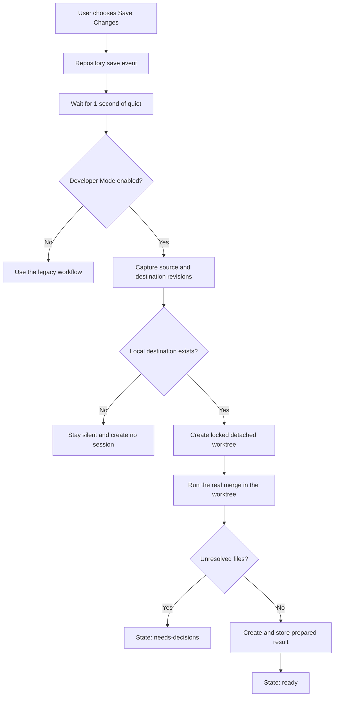
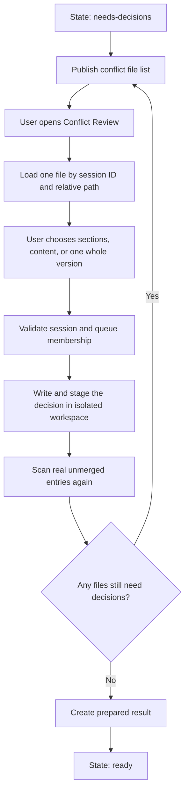
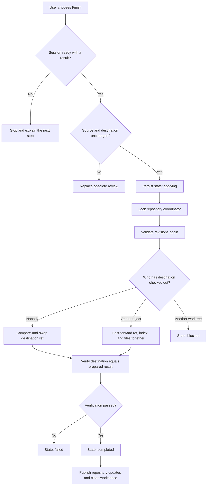
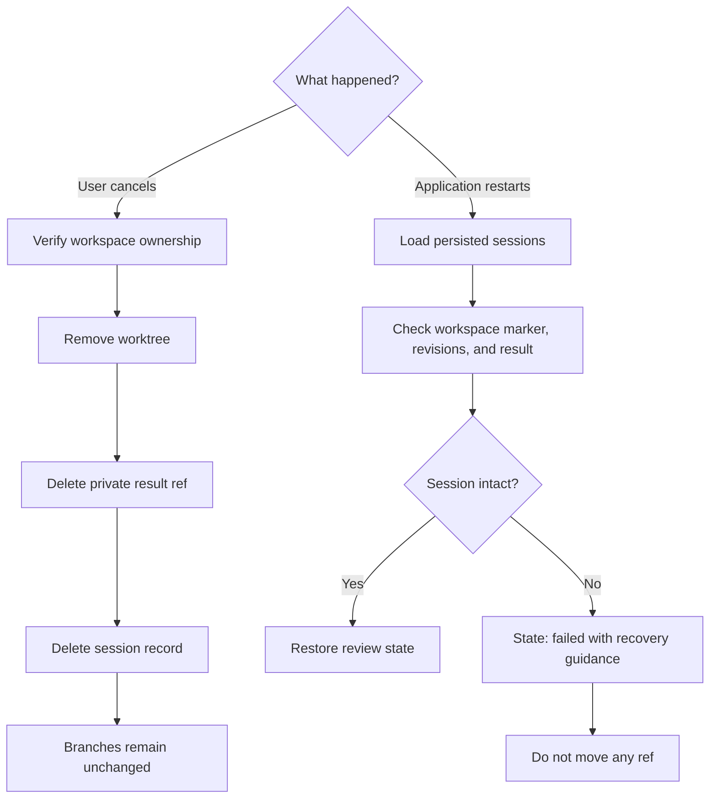

# IntegrationSessionService

> Default-branch Sync extension: before `ProgressService` pulls the configured
> upstream default branch, this service records a `default-sync` restoration
> baseline. A compatible conflicted pull is reconciled into the same persisted
> conflict queue and open-project resolution path used by feature updates.
> Conflict-free Sync still pushes automatically; an adopted conflict never
> pushes until the user explicitly chooses **Share updated work**. Sharing uses
> the persisted `ShareRef`, so the local and remote branch names may differ.

> How ControlZebra checks and resolves integration conflicts in an isolated working copy before the user chooses Finish.

## Purpose

`IntegrationSessionService` prepares the result of combining saved feature work with its destination branch without changing either branch. It performs the real Git operation in a backend-owned linked worktree, keeps any conflict decisions there, and applies the prepared result only when the user explicitly chooses **Finish**.

This design separates two actions that Git normally performs together:

1. **Readiness** computes and stores the result.
2. **Finish** verifies and applies that stored result.

The user's open project does not enter an unmerged state during readiness or conflict resolution.

The workflow is currently enabled only in Developer Mode. The legacy merge workflow remains active when Developer Mode is off.

## Key Terms

| Term | Meaning |
|---|---|
| Open project | The working copy the user has open in ControlZebra |
| Source | The saved feature branch the user is working on |
| Destination | The local branch that will receive the source, usually the shared branch |
| Session | One readiness check for an exact source revision, destination revision, and merge mode |
| Isolated workspace | A detached, locked Git worktree owned by ControlZebra |
| Prepared result | A commit stored under a private ControlZebra ref, not under a user branch |
| Conflict Review | The UI where the user makes decisions for files conflicted in the isolated workspace |

## Safety Model

A readiness result applies only to this immutable set of inputs:

```text
repository common directory
source revision
destination ref
destination revision
merge mode
```

If either branch moves, the existing answer is obsolete. ControlZebra discards it and prepares a new session instead of applying an answer based on old revisions.

The implementation maintains these invariants:

- Readiness never moves the source or destination branch.
- Conflict decisions modify only the isolated workspace.
- The frontend receives a session ID and repository-relative paths, never the workspace path.
- One repository, including all of its linked worktrees, has at most one active preparation.
- Finish applies the exact prepared result; it does not run the merge again.
- Cancellation is repeatable and never moves a branch.
- Startup recovery reports damaged sessions but never repairs them by moving a ref.

## Workflow 1: Background Readiness

Saving changes publishes a repository mutation event. The session service waits for a one-second quiet period so several quick saves produce one check. The automatic path prepares a squash result, which is the product default.



### Preparation Steps

1. Resolve the repository identity from `git rev-parse --git-common-dir` so linked worktrees share one coordinator and one active session.
2. Resolve the checked-out source ref and the local destination ref.
3. Capture both commit object IDs. Readiness does not fetch from a remote.
4. Check available disk space and, on Windows, the path-length budget.
5. Create a detached worktree at the destination revision.
6. Lock the worktree and write a session ownership marker in its Git administrative directory.
7. Run one of these operations in the isolated workspace:

```bash
# Regular mode
git merge --no-commit --no-ff <sourceOID>

# Squash mode
git merge --squash <sourceOID>
```

8. Classify real unmerged index entries with the same classifier used by `ConflictQueueService`.
9. If no decisions remain, write the index tree and create the prepared commit with `git commit-tree`.
10. Store the result at `refs/controlzebra/integration/<sessionID>` and mark the session `ready`.

`git commit-tree` is used because its tree and parent commits are explicit and it does not run project commit hooks. A regular result has destination and source parents. A squash result has only the destination parent.

If the source is already contained in the destination, the destination commit becomes the result. No empty commit is created.

## Workflow 2: Conflict Decisions

The service publishes a conflict snapshot as soon as the isolated merge finds unresolved files. Existing text, ladder, and whole-file resolvers are reused, but their backend operations point at the session workspace.



Before reading or changing a file, the backend checks all of the following:

- The session still exists and is in `needs-decisions`.
- The workspace ownership marker matches the session.
- The requested repository-relative path is in the current conflict queue.
- The resolution token is current.

A stale frontend event is ignored when its session ID or generation no longer matches the active review. Decisions from an obsolete session are not copied into a replacement session.

## Workflow 3: Finish

Finish is a guarded application protocol. It first checks the captured revisions, records the `applying` state, acquires the shared repository coordinator, and checks the revisions again while holding the lock. This second check closes the race between validation and branch movement.



The application method depends on how the destination is being used:

| Destination use | Git operation | Reason |
|---|---|---|
| Not checked out anywhere | `git update-ref <destinationRef> <resultOID> <destinationOID>` | The expected old object ID provides compare-and-swap behavior, and there are no working files to update |
| Checked out in the open project | `git merge --ff-only <resultOID>` | Git updates the branch, index, and files together and refuses if local work would be replaced |
| Checked out in another linked worktree | No mutation | Finish stops as `blocked` rather than changing another working copy |

After application, the service verifies that the destination points to the prepared result. When a working copy was updated, it also verifies that its index and files agree with `HEAD`. Only then does the session become `completed`.

The user remains on the branch they were working on. Finish does not switch the open project to the destination branch.

## Workflow 4: Cancel and Restart

Session records and workspaces are persisted so a review can survive an application restart. Cleanup and recovery are intentionally conservative.



Completed and cancelled records are removed during startup reconciliation. An active record becomes `failed` if its workspace is missing or unowned, if its source or destination revision vanished, or if its prepared result no longer exists.

## Session States

| State | Meaning | Next action |
|---|---|---|
| `scheduled` | A save earned a readiness check | Wait for preparation |
| `preparing` | The isolated merge is running | Continue working |
| `needs-decisions` | Real unmerged files exist in the isolated workspace | Resolve files in Conflict Review |
| `ready` | A prepared result exists and neither branch has moved | Choose Finish or cancel |
| `applying` | Finish was persisted and application is in progress | Wait for verification |
| `blocked` | The result is valid, but a working copy prevents safe application | Deal with the indicated local work or linked worktree, then retry Finish |
| `obsolete` | A captured source or destination revision changed | Prepare a replacement session |
| `completed` | The prepared result was applied and verified | Cleanup at startup removes the record |
| `failed` | Preparation, verification, or recovery could not be trusted | Follow the reported recovery action and retry |
| `cancelled` | The review was discarded without moving a branch | No further action |

## Persistence and Cleanup

Session metadata is stored as one atomically replaced JSON file per session. Directories use mode `0700`; metadata and ownership markers use mode `0600`. Session IDs are 128 random bits encoded as 32 hexadecimal characters and are validated before use in a path.

| Data | Location below the ControlZebra integration directory |
|---|---|
| Session records | `sessions/<sessionID>.json` |
| Detached worktrees | `workspaces/<sessionID>/` |
| Prepared result | `refs/controlzebra/integration/<sessionID>` inside the repository |
| Ownership marker | `controlzebra-session.json` inside the worktree administrative directory |

Workspace removal verifies ownership and is idempotent. On Windows it retries short-lived file-lock failures. The implementation does not use `git worktree prune`, because pruning could remove a review that ControlZebra still owns.

## Backend API

| Method | Contract |
|---|---|
| `PrepareReadiness(repoPath, squashMerge)` | Captures revisions and prepares or reuses a matching session |
| `ListSessions(repoPath)` | Lists sessions for the repository common directory |
| `GetSessionState(sessionID)` | Returns one full session snapshot |
| `GetSessionConflicts(sessionID)` | Returns the current full conflict snapshot |
| `GetSessionConflictResolutionData(sessionID, filePath)` | Loads one queued file for the resolver |
| `ResolveSessionConflictWithDecisions(...)` | Applies section-by-section choices in the isolated workspace |
| `ResolveSessionConflictWithContent(...)` | Applies fully composed file content in the isolated workspace |
| `ResolveSessionConflictWithSide(...)` | Keeps one complete version in the isolated workspace |
| `FinishSession(sessionID)` | Applies and verifies an existing prepared result |
| `CancelSession(sessionID)` | Idempotently removes the review without moving a branch |
| `RecoverSessions()` | Reconciles persisted sessions at startup without moving a ref |

Mutating methods return `OperationResult`. Query methods return typed snapshots. All Git commands run through `CommandRunner`, whose timeout is increased to five minutes for this service because preparation can materialize a large project.

## Frontend and Events

`IntegrationSessionContext` is the frontend adapter. In Developer Mode it lists the open repository's sessions, subscribes to full snapshots, and exposes preparation, Finish, cancellation, and resolution operations to the existing conflict UI.

| Event | Payload | Purpose |
|---|---|---|
| `integrationSession:changed` | `IntegrationSessionSnapshot` | Replaces the frontend's complete session state |
| `integrationSession:conflicts` | `SessionConflictSnapshot` | Replaces the complete file-decision queue for one session |

The conflict event is separate from `conflictQueue:changed`. This prevents the isolated session queue from overwriting the queue used for a repository that was opened with an already interrupted operation.

## Implementation Map

| Area | File |
|---|---|
| Service API, preparation, result creation, and Finish | `services/integration_session_service.go` |
| Background Save Changes trigger | `services/integration_session_scheduler.go` |
| Session conflict API | `services/integration_session_conflicts.go` |
| Atomic session records and lifecycle constants | `services/integration_session_store.go` |
| Worktree creation, ownership, preflight, and cleanup | `services/integration_session_workspace.go` |
| Startup reconciliation | `services/integration_session_reconcile.go` |
| Shared repository locking | `services/repo_coordinator.go` |
| Worktree-aware Git paths | `services/git_admin_paths.go` |
| Frontend state adapter | `frontend/src/features/integration/context/IntegrationSessionContext.tsx` |
| Finish UI | `frontend/src/features/merge/components/MergeFinishModal.tsx` |

## Current Limits

- Only saved revisions participate; unsaved files are not included in readiness.
- The destination must be a local branch. Readiness does not fetch a remote-only destination.
- Only one active session is supported per Git common repository.
- Submodules are detected but not initialized or updated in the isolated workspace.
- Git LFS content substitution is disabled while creating the workspace so large projects can prepare without downloading every object.
- Decisions from an obsolete review are not reused.
- The session workflow remains behind Developer Mode until the legacy path is removed.

**Related:** [[ConflictQueueService]] | [[Git Workflows]] | [[Event Reference]] | [[Isolated Conflict Resolution Plan]]
